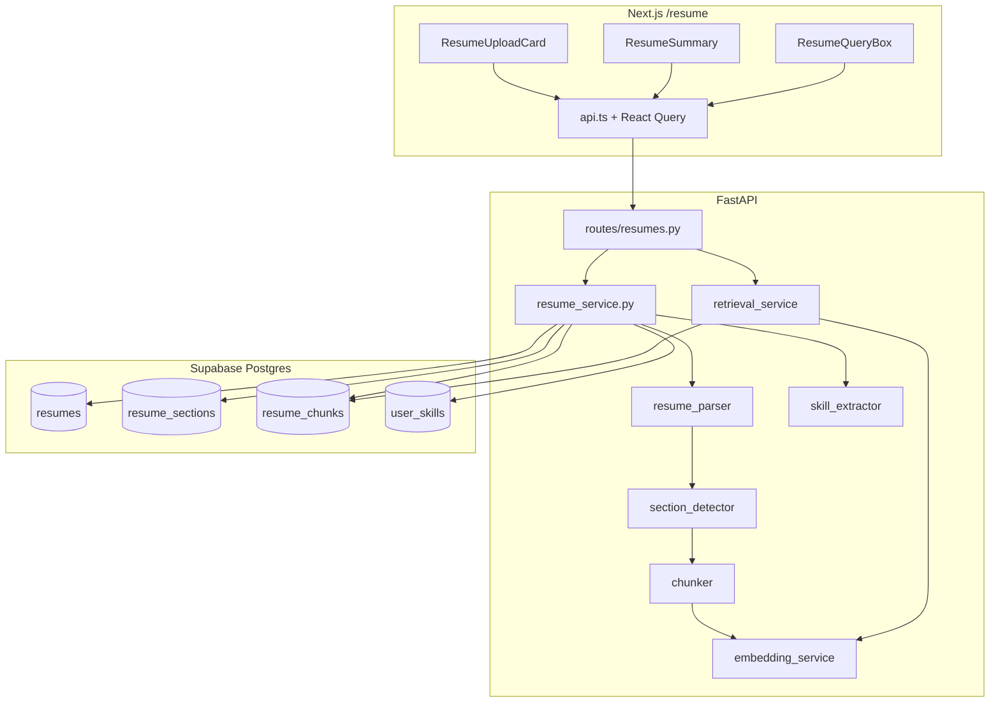

# CV Intelligence — Implementation Reference

> Last updated: May 26, 2026  
> Module owner area: `backend/app/cv_intelligence/`, `frontend/src/features/resume/`

This document describes how CV Intelligence is built end-to-end: data model, ingestion pipeline, embeddings, retrieval, API contracts, frontend integration, and tests.

---

## 1. Purpose and scope

CV Intelligence turns an uploaded resume (PDF or DOCX) into structured, searchable data:

| Output | Storage | Used for |
|---|---|---|
| Raw text | `resumes.raw_text` | Re-processing, debugging |
| Parsed summary | `resumes.parsed_summary` (JSON) | Quick stats in UI |
| Sections | `resume_sections` | Human-readable structure |
| Chunks + vectors | `resume_chunks` | RAG / semantic search |
| Skills | `user_skills` | Profile skills, future job matching |

**In scope today:** upload, parse, chunk, embed, extract skills, list/detail/query APIs, `/resume` UI.  
**Out of scope today:** file storage in Supabase Storage, LLM answers over chunks, job-resume matching.

---

## 2. Architecture overview



**Auth pattern:** Frontend sends `Authorization: Bearer <supabase_access_token>`. Backend validates via `get_current_user()` and uses the **service role** client for DB writes, scoping every query with `user_id`.

---

## 3. Database layer

### 3.1 Tables (from `20250525_001_initial_schema.sql`)

#### `resumes`

| Column | Type | Notes |
|---|---|---|
| `id` | uuid PK | |
| `user_id` | uuid FK → `profiles` | Owner |
| `file_name` | text | Original filename |
| `file_type` | text | Extension without dot, e.g. `pdf` |
| `file_url` | text nullable | Reserved for Storage URL (not set yet) |
| `raw_text` | text nullable | Full extracted text after success |
| `parsed_summary` | jsonb nullable | `{section_count, chunk_count, skill_count, section_names}` |
| `status` | `resume_status` enum | `uploaded`, `processing`, `processed`, `failed` |
| `is_active` | boolean | Only one active resume per user after upload |
| `error_message` | text nullable | Set when `status = failed` |

#### `resume_sections`

| Column | Type | Notes |
|---|---|---|
| `section_name` | text | Canonical name, e.g. `experience`, `skills` |
| `section_order` | int | 0-based order in document |
| `content` | text | Body text under that heading |

#### `resume_chunks`

| Column | Type | Notes |
|---|---|---|
| `section_id` | uuid nullable FK | Links to `resume_sections.id` |
| `section_name` | text | Denormalized for retrieval display |
| `chunk_index` | int | Global index within resume |
| `chunk_text` | text | Chunk body |
| `token_count` | int | Approximate: `len(chunk_text) // 4` |
| `embedding` | `vector(384)` | pgvector column; IVFFlat cosine index |

#### `user_skills`

| Column | Type | Notes |
|---|---|---|
| `skill_name` | text | Canonical name from keyword list |
| `category` | text | `language`, `framework`, `database`, `devops`, `cloud`, `ml/ai` |
| `evidence` | text | Snippet around first regex match |
| `source` | text | Always `resume` on upload |
| Unique | `(user_id, skill_name)` | Upsert ignores duplicates |

### 3.2 RLS and grants

- **RLS** is enabled on all CV tables (policies in initial migration for `authenticated` users).
- **Backend** uses the service role and enforces ownership in Python (`user_id` filters).
- **Grants migration** (`20250526120000_resume_cv_grants.sql`) explicitly grants `SELECT, INSERT, UPDATE, DELETE` on CV tables to `authenticated` and `service_role`. Without this, PostgREST returns `42501 permission denied for table resumes`.

### 3.3 pgvector

- Extension and `vector(384)` type are created in the initial migration.
- Index: `idx_resume_chunks_embedding` using `ivfflat` with `vector_cosine_ops`.
- **RPC functions** `match_resume_chunks` and `match_resume_chunks_with_resume` are **not** defined in migrations; retrieval code attempts them and falls back to Python (see §6).

---

## 4. Ingestion pipeline (`resume_service.process_resume`)

**Entry:** `POST /api/v1/resumes/upload` → `resume_service.process_resume(user_id, filename, file_bytes)`

### Step-by-step

| Step | Function | Behavior |
|---|---|---|
| 1 | `validate_file` | `.pdf` / `.docx` only; max 10 MB |
| 2 | Insert `resumes` | `status=processing`, `is_active=true` |
| 3 | `extract_text` | pypdf or python-docx; whitespace normalised; 422 if empty |
| 4 | `detect_sections` | Keyword headings → sections; else single `general` |
| 5 | Insert `resume_sections` | Batch insert; build `section_name → id` map |
| 6 | `chunk_sections` | 900-char windows, 150-char overlap, global `chunk_index` |
| 7 | `embed_batch` | HashingVectorizer → `list[list[float]]` length 384 |
| 8 | Insert `resume_chunks` | Includes `embedding` per row |
| 9 | `extract_skills` | Regex over curated keyword list |
| 10 | Upsert `user_skills` | `on_conflict=user_id,skill_name`, `ignore_duplicates=True` |
| 11 | Deactivate siblings | Other resumes: `is_active=false` |
| 12 | Final update | `status=processed`, `raw_text`, `parsed_summary` |

### Failure handling

- `HTTPException` (validation): resume marked `failed` with generic message, then re-raised.
- Other exceptions: `_mark_failed` with exception text (truncated 2000 chars), then `raise_http_for_supabase`.
- `_mark_failed` is best-effort (swallows its own errors).

### Read paths

| Function | Endpoint |
|---|---|
| `list_resumes` | `GET /resumes` |
| `get_resume_detail` | `GET /resumes/{id}` — sections, skills, chunk count |
| `get_resume_chunks` | `GET /resumes/{id}/chunks` — selects columns **without** embedding |

All reads use `run_supabase()` for consistent PostgREST error mapping.

---

## 5. Service modules (backend)

### 5.1 `resume_parser.py`

- **Constants:** `ALLOWED_EXTENSIONS = {".pdf", ".docx"}`, `MAX_FILE_BYTES = 10 MiB`
- **PDF:** `pypdf.PdfReader`, per-page `extract_text()`
- **DOCX:** `python-docx`, paragraph text joined
- **`_normalise`:** collapse spaces/tabs; max two consecutive newlines

### 5.2 `section_detector.py`

- **Dictionary:** `SECTION_HEADINGS` maps canonical names (`summary`, `experience`, `education`, `skills`, …) to alias lists.
- **Heading rules:** line ≤ 60 chars; alias match (exact, all-caps, or `startswith`).
- **Fallback:** one section `{ section_name: "general", content: full text }`
- **Empty sections:** skipped; if all empty → `general` fallback

### 5.3 `chunker.py`

- **Constants:** `CHUNK_SIZE = 900`, `OVERLAP = 150`
- **Step:** `CHUNK_SIZE - OVERLAP` per window (750 chars advance)
- **`token_count`:** `max(1, len(chunk_text) // 4)` — heuristic only, not a tokenizer

### 5.4 `embedding_service.py`

```python
HashingVectorizer(
    n_features=384,
    alternate_sign=False,
    norm="l2",
)
```

- **Singleton** vectorizer (lazy init).
- **`embed_text`:** single string → `list[float]` length 384.
- **`embed_batch`:** matrix transform → list of vectors in input order.
- **Properties:** deterministic, no network, fast cold start (important for Docker).
- **Trade-off:** bag-of-words style hashing, not semantic transformers — adequate for hackathon RAG demo and keyword-heavy CV text.

### 5.5 `skill_extractor.py`

- **~50 skills** across 6 categories in `_SKILL_DEFINITIONS`.
- **Matching:** pre-compiled case-insensitive regex per pattern; word boundaries where needed (`\bgo\b`, `\bjava\b`).
- **Evidence:** ±120 characters around first match.
- **Dedup:** one entry per canonical skill name.

### 5.6 `retrieval_service.py`

**Input:** `user_id`, `query`, `supabase`, optional `resume_id`, `top_k` (default 5).

1. `query_embedding = embed_text(query)`
2. Try RPC `match_resume_chunks` or `match_resume_chunks_with_resume`
3. On failure or empty → `_python_cosine_search`:
   - Fetch chunks (`id`, `resume_id`, `section_name`, `chunk_text`, `embedding`)
   - Parse embedding (list or `"[0.1,0.2,...]"` string)
   - L2-normalize query and chunk vectors; `similarity = dot(q, c)`
   - Sort descending, return top_k

**Response shape (each hit):**

```json
{
  "chunk_id": "uuid",
  "resume_id": "uuid",
  "section_name": "experience",
  "chunk_text": "...",
  "similarity": 0.8421
}
```

### 5.7 `supabase_errors.py`

| PostgREST code | HTTP | Client message |
|---|---|---|
| `42501` | 500 | Hint to apply `20250526120000_resume_cv_grants.sql` |
| `PGRST116` | 404 | Resource not found |
| Other | 500 | Safe message + optional hint |

`run_supabase(context, fn)` wraps read paths; upload path uses `raise_http_for_supabase` on unexpected errors.

---

## 6. API reference

**Base path:** `/api/v1/resumes`  
**Auth:** `Authorization: Bearer <token>` required on all routes.

### `POST /upload`

- **Content-Type:** `multipart/form-data`
- **Field:** `file` (PDF or DOCX)
- **Response:** `201` + `Resume` model
- **Errors:** `422` invalid file/empty text; `401` missing token; `500` processing/DB

### `GET /`

- **Response:** `Resume[]` ordered by `created_at` desc

### `GET /{resume_id}`

- **Response:**

```json
{
  "resume": { "...": "..." },
  "sections": [ "..." ],
  "skills": [ "..." ],
  "chunk_count": 12
}
```

### `GET /{resume_id}/chunks`

- **Response:** `ResumeChunk[]` without embedding field in SELECT

### `POST /query`

- **Body:**

```json
{
  "query": "Python FastAPI experience",
  "resume_id": "optional-uuid",
  "top_k": 5
}
```

- **Response:** `ChunkQueryResult[]` (bare array)

---

## 7. Pydantic models

| Model | File | Role |
|---|---|---|
| `Resume` | `models/resume.py` | Full resume row |
| `ResumeSection` | `models/resume_section.py` | Section row |
| `ResumeChunk` | `models/resume_chunk.py` | Chunk row (embedding optional on read) |
| `UserSkill` | `models/user_skill.py` | Extracted skill row |

Route-specific schemas in `routes/resumes.py`: `ResumeDetailResponse`, `QueryRequest`, `ChunkQueryResult`.

**Status enum:** `app.core.enums.ResumeStatus` — `uploaded`, `processing`, `processed`, `failed`.

---

## 8. Frontend implementation

### 8.1 Routing

- `src/app/resume/page.tsx` — server component; `getUser()` → redirect `/login?next=/resume`
- `ResumePageClient` — main UI

### 8.2 API client (`features/resume/api.ts`)

Uses shared `apiRequest` from `src/lib/api.ts`:

- Attaches Bearer token from `supabase.auth.getSession()`
- `uploadResume`: `FormData` without forcing `Content-Type` (browser sets boundary)
- `queryResume`: JSON body with snake_case keys (`resume_id`, `top_k`)

### 8.3 React Query (`hooks.ts`)

| Hook | Key | Purpose |
|---|---|---|
| `useResumes` | `["resumes"]` | List |
| `useResume(id)` | `["resumes", id]` | Detail |
| `useUploadResume` | mutation | Invalidates list + detail on success |
| `useQueryResume` | mutation | RAG search (no cache invalidation) |

### 8.4 UI behavior

- **Status badge:** `no_cv` | `processing` | `failed` | `rag_ready`
- **Resume selector:** shown when user has more than one resume
- **Primary resume:** `is_active` or first in list
- **RAG box:** enabled only when `resume.status === "processed"`; scopes query with `resume_id`
- **Similarity display:** `Math.round(score * 100)%` in UI

### 8.5 Validation (client)

Mirrors backend: `.pdf`/`.docx`, 10 MB max, non-empty file — in `validateResumeFile()` before upload.

---

## 9. FastAPI app integration

`backend/main.py`:

- Registers `resumes_router` at `settings.api_v1_prefix` (`/api/v1`)
- **CORS** middleware from `settings.cors_origins`
- **Exception handlers** attach CORS headers to `HTTPException` and unhandled `500` responses (fixes browser “CORS error” masking real API failures)

---

## 10. Testing

Location: `backend/test/CV-intelligence/`

| File | Focus |
|---|---|
| `test_resume_parser.py` | PDF/DOCX extraction, validation, normalisation |
| `test_section_detector.py` | Heading detection, fallbacks |
| `test_chunker.py` | Window size, overlap, global index |
| `test_skill_extractor.py` | Categories, dedup, evidence |
| `test_embedding_service.py` | Dimension 384, floats, similarity property |

```bash
cd backend
python -m pytest test/CV-intelligence/ -v
```

**Current result:** 95 passed, 1 skipped (PDF generation test without `reportlab`).

---

## 11. Configuration and dependencies

**`backend/requirements.txt` (CV-relevant):**

- `pypdf`, `python-docx` — parsing
- `scikit-learn` — embeddings
- `numpy` — retrieval fallback
- `python-multipart` — upload
- `supabase`, `fastapi`, `pydantic` — API + DB

**Not required:** `sentence-transformers`, `torch`, `HF_TOKEN` (removed in favour of HashingVectorizer).

---

## 12. Extension points (planned)

| Item | Suggested approach |
|---|---|
| pgvector RPC | Migration defining `match_resume_chunks(query_embedding, match_user_id, match_count)` using `<=>` cosine distance |
| File storage | Upload bytes to Supabase Storage; set `resumes.file_url` |
| Better embeddings | Optional env flag to swap `embedding_service` implementation |
| LLM RAG answers | New endpoint: retrieve chunks → prompt Claude with `ANTHROPIC_API_KEY` |
| Job matching | Compare `user_skills` to `jobs.requirements` |

---

## 13. File index (quick lookup)

```
backend/app/cv_intelligence/
├── routes/resumes.py
├── models/
│   ├── resume.py
│   ├── resume_section.py
│   ├── resume_chunk.py
│   └── user_skill.py
└── services/
    ├── resume_service.py      # orchestrator
    ├── resume_parser.py
    ├── section_detector.py
    ├── chunker.py
    ├── embedding_service.py
    ├── skill_extractor.py
    └── retrieval_service.py

frontend/src/features/resume/
├── api.ts
├── hooks.ts
├── types.ts
├── resume-page-client.tsx
├── resume-upload-card.tsx
├── resume-summary.tsx
└── resume-query-box.tsx

backend/app/core/supabase_errors.py
supabase/migrations/20250526120000_resume_cv_grants.sql
```
