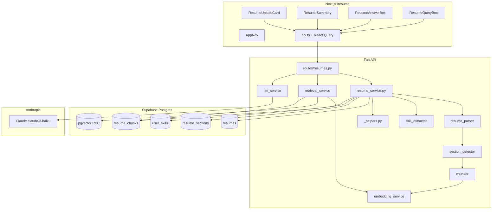

# CV Intelligence — Implementation Reference

> Last updated: May 26, 2026  
> Module owner area: `backend/app/cv_intelligence/`, `frontend/src/features/resume/`

This document describes how CV Intelligence is built end-to-end: data model, ingestion pipeline, embeddings, LLM answers, retrieval, API contracts, frontend integration, and tests.

---

## 1. Purpose and scope

CV Intelligence turns an uploaded resume (PDF or DOCX) into structured, searchable data, and grounds AI answers in that data:

| Output | Storage | Used for |
|---|---|---|
| Raw text | `resumes.raw_text` | Re-processing, debugging |
| Parsed summary | `resumes.parsed_summary` (JSON) | Quick stats in UI |
| Sections | `resume_sections` | Human-readable structure |
| Chunks + vectors | `resume_chunks` | RAG / semantic search |
| Skills | `user_skills` | Profile skills, future job matching |
| AI answers | None (generated at request time) | User questions grounded in CV |

**In scope:** upload, parse, chunk, embed, skill extract, list/detail/query/answer/delete APIs, `/resume` UI.  
**Out of scope:** file storage in Supabase Storage, OCR for scanned PDFs, multi-turn assistant conversation history.

---

## 2. Architecture overview



**Auth pattern:** Frontend sends `Authorization: Bearer <supabase_access_token>`. Backend validates via `get_current_user()` and uses the **service role** client for all DB writes, scoping every query with `user_id`.

---

## 3. Database layer

### 3.1 Tables (from `supabase/migrations/20250525_001_initial_schema.sql`)

#### `resumes`

| Column | Type | Notes |
|---|---|---|
| `id` | uuid PK | |
| `user_id` | uuid FK → `profiles` | Owner |
| `file_name` | text | Original filename |
| `file_type` | text | Extension without dot, e.g. `pdf` |
| `file_url` | text nullable | Reserved for Storage URL (not yet populated) |
| `raw_text` | text nullable | Full extracted text after success |
| `parsed_summary` | jsonb nullable | `{section_count, chunk_count, skill_count, section_names}` |
| `status` | `resume_status` enum | `uploaded`, `processing`, `processed`, `failed` |
| `is_active` | boolean | Only one active resume per user |
| `error_message` | text nullable | Set when `status = failed` |

#### `resume_sections`

| Column | Type | Notes |
|---|---|---|
| `section_name` | text | Canonical name, e.g. `experience`, `skills` |
| `section_order` | int | 0-based order in document |
| `content` | text | Body text under that heading |

#### `resume_chunks`

| Column | Type | Notes |
|---|---|---|
| `section_id` | uuid nullable FK | Links to `resume_sections.id` |
| `section_name` | text | Denormalized for retrieval display |
| `chunk_index` | int | Global index within resume |
| `chunk_text` | text | Chunk body |
| `token_count` | int | Approximate: `len(chunk_text) // 4` |
| `embedding` | `vector(384)` | pgvector column; IVFFlat cosine index |

#### `user_skills`

| Column | Type | Notes |
|---|---|---|
| `skill_name` | text | Canonical name from keyword list |
| `category` | text | `language`, `framework`, `database`, `devops`, `cloud`, `ml/ai` |
| `evidence` | text | Snippet around first regex match |
| `source` | text | Always `resume` on upload |
| Unique | `(user_id, skill_name)` | Upsert ignores duplicates |

### 3.2 RLS and grants

- **RLS** is enabled on all CV tables; policies allow row access by `auth.uid() = user_id`.
- **Backend** uses the service role and enforces ownership in Python (`user_id` filters on every query).
- **Grants migration** `20250526120000_resume_cv_grants.sql` grants `SELECT, INSERT, UPDATE, DELETE` on CV tables to `authenticated` and `service_role`. Without this, PostgREST returns `42501 permission denied for table resumes`.

### 3.3 pgvector

- Extension and `vector(384)` type in the initial migration.
- IVFFlat index: `idx_resume_chunks_embedding` using `ivfflat` with `vector_cosine_ops`.
- **RPC functions** `match_resume_chunks` and `match_resume_chunks_with_resume` defined in `supabase/migrations/20250526130000_pgvector_rpc.sql`. Both set `ivfflat.probes = 10` inside the function body.

---

## 4. Ingestion pipeline (`resume_service.process_resume`)

**Entry:** `POST /api/v1/resumes/upload` → `resume_service.process_resume(user_id, filename, file_bytes)`

| Step | Function | Behavior |
|---|---|---|
| 1 | `validate_file` | `.pdf` / `.docx` only; max 10 MB |
| 2 | Insert `resumes` | `status=processing`, `is_active=true` |
| 3 | `extract_text` | pypdf or python-docx; whitespace normalised; 422 if empty |
| 4 | `detect_sections` | Keyword headings → sections; else single `general` |
| 5 | Insert `resume_sections` | Batch insert; build `section_name → id` map |
| 6 | `chunk_sections` | 900-char windows, 150-char overlap, global `chunk_index` |
| 7 | `embed_batch` | HashingVectorizer **or** sentence-transformers → `list[list[float]]` length 384 |
| 8 | Insert `resume_chunks` | Includes `embedding` per row |
| 9 | `extract_skills` | Regex over curated keyword list (~50 skills) |
| 10 | Upsert `user_skills` | `on_conflict=user_id,skill_name`, `ignore_duplicates=True` |
| 11 | Deactivate siblings | Other resumes: `is_active=false` |
| 12 | Final update | `status=processed`, `raw_text`, `parsed_summary` |

**Failure handling:**
- `HTTPException` (validation): resume marked `failed`, original exception re-raised.
- Other exceptions: `_mark_failed` with exception text (truncated to 2000 chars), then `raise_http_for_supabase`.
- `_mark_failed` is best-effort — swallows its own errors so it doesn't obscure the original.

---

## 5. Service modules (backend)

### 5.1 `_helpers.py`

Shared Supabase response helpers used by all services in this module:

```python
def _rows(response) -> list[dict]  # extracts list from APIResponse
def _row(response) -> dict | None  # extracts first row or None
```

Previously duplicated in `resume_service.py` and `retrieval_service.py`; extracted to avoid drift.

### 5.2 `resume_parser.py`

- **Constants:** `ALLOWED_EXTENSIONS = {".pdf", ".docx"}`, `MAX_FILE_BYTES = 10 MiB`
- **PDF:** `pypdf.PdfReader`, per-page `extract_text()` — does **not** handle scanned/image PDFs
- **DOCX:** `python-docx`, paragraph text joined — tables/headers/footers in body paragraphs only
- **`_normalise`:** collapse spaces/tabs; max two consecutive newlines

### 5.3 `section_detector.py`

- **Dictionary:** `SECTION_HEADINGS` maps canonical names to alias lists (9 canonical sections)
- **Heading rules:** line ≤ 60 chars; exact alias match, all-caps match, or `startswith` match
- **Fallback:** single section `{ section_name: "general", content: full text }` when no headings detected

### 5.4 `chunker.py`

- **Constants:** `CHUNK_SIZE = 900`, `OVERLAP = 150` (750-char step)
- **`token_count`:** `max(1, len(chunk_text) // 4)` — heuristic, not a tokenizer

### 5.5 `embedding_service.py`

Two selectable backends via `EMBEDDING_BACKEND` environment variable:

| Backend | Value | Properties |
|---|---|---|
| HashingVectorizer | `hashing` (default) | Deterministic, no model download, fast cold start, bag-of-words quality |
| sentence-transformers | `transformers` | Semantic quality, ~90 MB download, requires `pip install sentence-transformers` |

Both produce `list[float]` of length 384, compatible with the `vector(384)` column.

```python
embed_text(text: str) -> list[float]       # single text
embed_batch(texts: list[str]) -> list[list[float]]  # batch
```

### 5.6 `skill_extractor.py`

- **~50 skills** across 6 categories in `_SKILL_DEFINITIONS`
- Pre-compiled case-insensitive regex per pattern; word boundaries where needed
- Evidence: ±120 characters around first match
- Dedup: one entry per canonical skill name

### 5.7 `retrieval_service.py`

**Input:** `user_id`, `query`, `supabase`, optional `resume_id`, `top_k` (default 5), `min_similarity` (default 0.05)

1. `query_embedding = embed_text(query)`
2. Try RPC `match_resume_chunks` or `match_resume_chunks_with_resume` — IVFFlat search, `probes=10`
3. On RPC failure or empty → `_python_cosine_search` (numpy L2-normalize + dot product)
4. Both paths filter results where `similarity < min_similarity`

**Response shape:**

```json
{
  "chunk_id": "uuid",
  "resume_id": "uuid",
  "section_name": "experience",
  "chunk_text": "...",
  "similarity": 0.8421
}
```

### 5.8 `llm_service.py`

**Input:** `question: str`, `chunks: list[dict]`

**System prompt (excerpt):**
> You are CareerPilot. Answer the user's question using ONLY the information present in the CV excerpts. Never invent work experience, skills, education, or achievements not found in the excerpts.

- Uses `claude-3-haiku-20240307` — fast and cost-efficient for short answers
- Context budget: 600 chars per chunk, 6000 chars total
- Max tokens: 512
- Graceful fallback if `ANTHROPIC_API_KEY` is missing or `anthropic` package not installed

### 5.9 `resume_service.py` — delete

```python
def delete_resume(user_id: str, resume_id: str) -> None
```

- Ownership check via `_get_owned_resume` → raises 404 if not found/owned
- DB cascade removes `resume_sections` and `resume_chunks` automatically
- `user_skills.resume_id` set to NULL (on delete set null)

---

## 6. API reference

**Base path:** `/api/v1/resumes`  
**Auth:** `Authorization: Bearer <token>` required on all routes.

### `POST /upload`

- **Content-Type:** `multipart/form-data`
- **Field:** `file` (PDF or DOCX)
- **Response:** `201` + `Resume` model
- **Errors:** `422` invalid file/empty text; `401` missing token; `500` processing/DB

### `GET /`

- **Response:** `Resume[]` ordered by `created_at` desc

### `GET /{resume_id}`

- **Response:**

```json
{
  "resume": { "...": "..." },
  "sections": [ "..." ],
  "skills": [ "..." ],
  "chunk_count": 12
}
```

### `GET /{resume_id}/chunks`

- **Response:** `ResumeChunk[]` without `embedding` field in SELECT

### `POST /query`

- **Body:**

```json
{
  "query": "Python FastAPI experience",
  "resume_id": "optional-uuid",
  "top_k": 5
}
```

- **Response:** `ChunkQueryResult[]` (bare array)

### `POST /answer`

- **Body:**

```json
{
  "question": "Summarize my professional background",
  "resume_id": "optional-uuid",
  "top_k": 5
}
```

- **Response:**

```json
{
  "answer": "Based on your CV, you have 5 years of experience...",
  "evidence_chunks": [ { "chunk_id": "...", "similarity": 0.82, "chunk_text": "..." } ]
}
```

- **Notes:** If `ANTHROPIC_API_KEY` is not configured, returns a clear fallback message rather than a 500.

### `DELETE /{resume_id}`

- **Response:** `204 No Content`
- **Errors:** `404` if not found or owned by another user

---

## 7. Pydantic models

| Model | File | Role |
|---|---|---|
| `Resume` | `models/resume.py` | Full resume row |
| `ResumeSection` | `models/resume_section.py` | Section row |
| `ResumeChunk` | `models/resume_chunk.py` | Chunk row (embedding optional on read) |
| `UserSkill` | `models/user_skill.py` | Extracted skill row |

Route-specific schemas in `routes/resumes.py`: `ResumeDetailResponse`, `QueryRequest`, `AnswerRequest`, `AnswerResponse`, `ChunkQueryResult`.

**Status enum:** `app.core.enums.ResumeStatus` — `uploaded`, `processing`, `processed`, `failed`.

---

## 8. Frontend implementation

### 8.1 Routing

- `src/app/resume/page.tsx` — server component; `getUser()` → redirect `/login?next=/resume`; renders `<AppNav />` + `<ResumePageClient />`

### 8.2 Components

| Component | File | Role |
|---|---|---|
| `AppNav` | `components/nav/AppNav.tsx` | Sticky top navbar; active-route highlighting; links to Tracker/CV/Goals |
| `ResumePageClient` | `features/resume/resume-page-client.tsx` | Page layout, resume selector, status badge, sign-out |
| `ResumeUploadCard` | `features/resume/resume-upload-card.tsx` | Animated drop zone, file icon/size, clear button, processing status strip |
| `ResumeSummary` | `features/resume/resume-summary.tsx` | Skeleton loader, expandable section cards, category-colored skill chips, delete/retry |
| `ResumeAnswerBox` | `features/resume/resume-answer-box.tsx` | AI answer panel, sample query chips, ⌘+Enter submit, collapsible evidence |
| `ResumeQueryBox` | `features/resume/resume-query-box.tsx` | Raw chunk search view (similarity bars, expand/collapse) |

### 8.3 API client (`features/resume/api.ts`)

Uses shared `apiRequest` from `src/lib/api.ts`:

- Attaches Bearer token from `supabase.auth.getSession()`
- `uploadResume`: `FormData` without forcing `Content-Type` (browser sets boundary)
- `queryResume`: JSON with snake_case keys (`resume_id`, `top_k`)
- `askCvQuestion`: JSON with `{ question, resume_id?, top_k? }`
- `deleteResume`: `DELETE /{id}` — returns `void` (204)

### 8.4 React Query (`hooks.ts`)

| Hook | Type | Purpose |
|---|---|---|
| `useResumes` | query | List user resumes |
| `useResume(id)` | query | Resume detail |
| `useUploadResume` | mutation | Upload; invalidates list + detail; `toast.success` on done |
| `useDeleteResume` | mutation | Delete; invalidates list; `toast.success`/`toast.error` |
| `useQueryResume` | mutation | Raw chunk search |
| `useAskCvQuestion` | mutation | AI answer; `toast.error` on failure |

### 8.5 Toast notifications (Sonner)

`Toaster` is mounted in `app/providers.tsx` (top-right, 4s auto-dismiss, `richColors`).

Used for:
- Upload success / error
- Delete success / error
- AI answer error

### 8.6 UI behaviors

- **Status badge:** `no_cv` | `processing` | `failed` | `rag_ready` — shown in page header
- **Primary resume:** `is_active` or first in list; auto-selected after upload
- **Resume selector:** shown when user has > 1 resume
- **Answer box:** enabled only when `resume.status === "processed"`
- **Evidence toggle:** collapsible section under the AI answer showing retrieved chunks
- **Similarity display:** filled progress bar + percentage beside each chunk
- **Skill chips:** color-coded by category (blue=language, violet=framework, orange=database, slate=devops, sky=cloud, pink=ml/ai)
- **Section cards:** expand/collapse toggle to see full section text
- **Delete:** requires confirmation before firing the API call
- **Skeleton loader:** shimmer placeholder shown during initial detail fetch

---

## 9. FastAPI app integration

`backend/main.py`:

- Registers `resumes_router` at `settings.api_v1_prefix` (`/api/v1`)
- **CORS** middleware from `settings.cors_origins` (default: `http://localhost:3000`)
- **Exception handlers** attach CORS headers to `HTTPException` and unhandled `500` responses

---

## 10. Testing

Location: `backend/test/CV-intelligence/`

| File | Focus |
|---|---|
| `test_resume_parser.py` | PDF/DOCX extraction, validation, normalisation |
| `test_section_detector.py` | Heading detection, fallbacks |
| `test_chunker.py` | Window size, overlap, global index |
| `test_skill_extractor.py` | Categories, dedup, evidence |
| `test_embedding_service.py` | Dimension 384, floats, cosine similarity sanity |

```bash
cd backend
python -m pytest test/CV-intelligence/ -v
# Expected: 95 passed, 1 skipped (PDF round-trip without reportlab)
```

No automated integration tests against live Supabase — manual testing required for the full upload → answer → delete flow.

---

## 11. Configuration and dependencies

**`backend/requirements.txt` (CV-relevant):**

- `pypdf`, `python-docx` — parsing
- `scikit-learn` — HashingVectorizer embeddings (default)
- `sentence-transformers` — semantic embeddings (when `EMBEDDING_BACKEND=transformers`)
- `numpy` — retrieval fallback cosine similarity
- `python-multipart` — multipart upload
- `anthropic` — Claude API for `/answer`
- `supabase`, `fastapi`, `pydantic` — API + DB

**`EMBEDDING_BACKEND` env var:**

| Value | Behavior |
|---|---|
| `hashing` (default) | sklearn HashingVectorizer — no download, deterministic, bag-of-words quality |
| `transformers` | sentence-transformers `all-MiniLM-L6-v2` — ~90 MB download on first run, semantic quality |

Both produce 384-dim L2-normalized vectors, compatible with the existing `vector(384)` DB column.

---

## 12. Extension points (planned)

| Item | Suggested approach |
|---|---|
| File storage | Upload bytes to Supabase Storage bucket `resumes/{user_id}/`; set `resumes.file_url` |
| Re-process resume | `POST /{id}/reprocess` — re-run pipeline on stored `raw_text` |
| Better skill extraction | Replace regex with NER model or LLM-based extraction |
| Job matching | Compare `user_skills` to `jobs.requirements`; use `resume_chunks` for semantic fit score |
| LLM skill gap | `POST /skill-gaps/analyze` — Claude compares CV chunks to job description |
| Cover letter | `POST /cover-letters/generate` — Claude with CV chunks + job data |
| pgvector HNSW | Upgrade IVFFlat to HNSW for better recall at large scale |

---

## 13. File index

```
backend/app/cv_intelligence/
├── routes/resumes.py               # 7 endpoints
├── models/
│   ├── resume.py
│   ├── resume_section.py
│   ├── resume_chunk.py
│   └── user_skill.py
└── services/
    ├── _helpers.py                 # shared _rows()/_row()
    ├── resume_service.py           # orchestrator + delete
    ├── resume_parser.py
    ├── section_detector.py
    ├── chunker.py
    ├── embedding_service.py        # dual-backend
    ├── skill_extractor.py
    ├── retrieval_service.py        # pgvector RPC + numpy fallback + min_similarity
    └── llm_service.py              # Anthropic Claude

frontend/src/features/resume/
├── api.ts                          # upload, delete, query, askCvQuestion
├── hooks.ts                        # mutations + queries + toasts
├── types.ts                        # Resume, ResumeDetail, CvAnswer*
├── resume-page-client.tsx
├── resume-upload-card.tsx          # redesigned UX
├── resume-summary.tsx              # skeleton, expandable, delete, retry
├── resume-answer-box.tsx           # AI answer panel (new)
└── resume-query-box.tsx            # raw chunk search

frontend/src/components/nav/
└── AppNav.tsx                      # global navigation (new)

supabase/migrations/
├── 20250525_001_initial_schema.sql
├── 20250526120000_resume_cv_grants.sql
└── 20250526130000_pgvector_rpc.sql  # match_resume_chunks functions (new)

backend/app/core/supabase_errors.py
```
