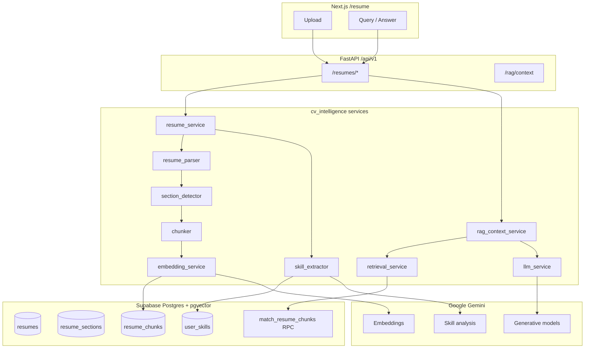
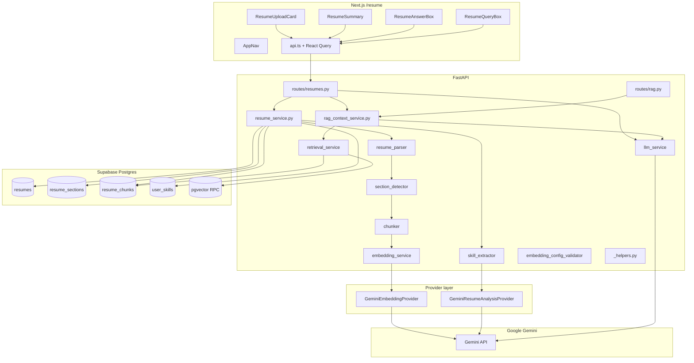

# CV Intelligence — Implementation Reference

> Last updated: May 29, 2026  
> Module owner area: `backend/app/cv_intelligence/`, `frontend/src/features/resume/`

This document describes how **CV Intelligence** (also **Resume Intelligence**) is built end-to-end: data model, ingestion pipeline, embeddings, retrieval, RAG, LLM answers, API contracts, downstream consumers, frontend integration, and tests.

---

## 1. Purpose and scope

CV Intelligence turns an uploaded resume (**PDF** or **DOCX**) into structured, searchable data and powers **RAG** (Retrieval-Augmented Generation) for Q&A, job fit, and career artifacts.

| Output | Storage | Used for |
|---|---|---|
| Raw text | `resumes.raw_text` | Re-processing, debugging |
| Parsed summary | `resumes.parsed_summary` (JSONB) | Quick stats in UI |
| Sections | `resume_sections` | Human-readable structure |
| Chunks + vectors | `resume_chunks` | **Semantic search**, **RAG** |
| Skills | `user_skills` | Profile skills, **job matching** |
| AI answers | None (generated at request time) | **Grounded** Q&A with evidence citations |

**In scope:** upload, parse, chunk, embed, skill extract, list/detail/query/answer/delete APIs, shared RAG context API, `/resume` UI.  
**Out of scope:** file storage in Supabase Storage, OCR for scanned PDFs, multi-turn assistant conversation history in this module.

**Keyword cheat sheet:** `ingestion`, `structured extraction`, `vector indexing`, `skill profiling`, `semantic retrieval`, `grounded LLM`, `evidence citations`, `pgvector`, `provider abstraction`.

---

## 2. End-to-end mechanism summary

### 2.1 One-line mental model

**Upload → parse → sectionize → chunk → embed (Gemini) → store (pgvector) → extract skills → on query: embed question → retrieve top-k chunks (RPC or NumPy) → ground Gemini answer in excerpts only.**

### 2.2 Layered architecture



**Auth keywords:** `Bearer JWT`, `get_current_user()`, **service-role Supabase client**, `user_id` scoping (backend enforces ownership; RLS on DB for direct client access).

### 2.3 Ingestion pipeline (12 steps)

Orchestrated in `resume_service.process_resume()` — entry: **`POST /api/v1/resumes/upload`**.

| Step | Component | Mechanism |
|------|-----------|-----------|
| 1 | `resume_parser.validate_file` | PDF/DOCX only, max **10 MB** |
| 2 | DB insert | `status=processing`, `is_active=true` |
| 3 | `extract_text` | **pypdf** / **python-docx**; whitespace normalization; fails on empty text |
| 4 | `detect_sections` | Keyword heading dictionary → canonical sections; fallback: single `general` section |
| 5 | Insert `resume_sections` | Ordered sections with `section_order` |
| 6 | `chunk_sections` | **Sliding window**: 900 chars, 150 overlap; global `chunk_index`; heuristic `token_count = len//4` |
| 7 | `embed_batch` → `embed_document_batch` | **Gemini embeddings**, `task_type=retrieval_document` |
| 8 | Insert `resume_chunks` | Writes to `EMBEDDING_ACTIVE_COLUMN` (default `embedding`) |
| 9 | `extract_skills` | **Gemini analysis provider** first; **regex keyword fallback** (~50 skills, 6 categories) |
| 10 | Upsert `user_skills` | `on_conflict=user_id,skill_name` |
| 11 | Deactivate siblings | Other resumes → `is_active=false` |
| 12 | Finalize | `status=processed`, `raw_text`, `parsed_summary` |

**Failure keywords:** `ResumeStatus.FAILED`, `_mark_failed`, `HTTPException` vs generic `500`.

### 2.4 Retrieval and RAG

**Low-level search** (`retrieval_service.search_chunks`):

1. `embed_query_text(query)` — query embedding (`retrieval_query`).
2. **Primary:** Supabase RPC `match_resume_chunks` / `match_resume_chunks_with_resume` — pgvector cosine via `<=>`.
3. **Fallback:** Fetch chunks + **NumPy** L2-normalized cosine similarity in Python.
4. **Filter:** `min_similarity` (default **0.05**).
5. RPC only when `embedding_active_column == "embedding"`.

**RAG orchestration** (`rag_context_service.retrieve_cv_context`):

| Feature | Behavior |
|---------|----------|
| Resume resolution | Explicit `resume_id` or **active processed** resume |
| Intent-aware retrieval | `general`, `cover_letter`, `skill_gap`, `readiness_check`, `roadmap_generation` — different `top_k` and query hints |
| Context formatting | Chunks → `context_text` (600 chars/chunk, 6000 total) for LLM prompts |
| Skills enrichment | Loads `user_skills` alongside chunks |
| Empty states | `empty_reason` when no resume, still processing, or no matches |

### 2.5 LLM generation (`llm_service`)

| Capability | Function | Grounding rule |
|------------|----------|----------------|
| CV Q&A | `answer_from_chunks` | Answer **only** from retrieved excerpts |
| Cover letter | `generate_cover_letter` | Used by `career_generation_service` |
| Skill gap | `analyze_skill_gap` | JSON output; CV + JD skills |
| Roadmap | `generate_roadmap` | Weekly plan from gaps + CV |

**Model cascade:** `gemini-2.5-pro` → `2.5-flash` → `2.0-flash` → `1.5-flash` on quota errors.

### 2.6 Downstream consumers

| Consumer | Usage |
|----------|--------|
| `career_generation_service` | Cover letters, skill-gap analysis, roadmaps via `_require_rag_context` + `llm_service` |
| `job_scorer` | **Hybrid fit score**: `0.6 × skills_overlap + 0.4 × mean_chunk_similarity` |
| Frontend `/resume` | Upload, summary, semantic query, AI answer with evidence UI |
| AI assistant `/chat` | Can use RAG context for CV-grounded chat (separate Next.js Gemini stream) |

---

## 3. Architecture overview (detailed)



**Auth pattern:** Frontend sends `Authorization: Bearer <supabase_access_token>`. Backend validates via `get_current_user()` and uses the **service role** client for all DB writes, scoping every query with `user_id`.

---

## 4. Database layer

### 4.1 Tables (from `supabase/migrations/20250525_001_initial_schema.sql`)

#### `resumes`

| Column | Type | Notes |
|---|---|---|
| `id` | uuid PK | |
| `user_id` | uuid FK → `profiles` | Owner |
| `file_name` | text | Original filename |
| `file_type` | text | Extension without dot, e.g. `pdf` |
| `file_url` | text nullable | Reserved for Storage URL (not yet populated) |
| `raw_text` | text nullable | Full extracted text after success |
| `parsed_summary` | jsonb nullable | `{section_count, chunk_count, skill_count, section_names}` |
| `status` | `resume_status` enum | `uploaded`, `processing`, `processed`, `failed` |
| `is_active` | boolean | Only one active resume per user |
| `error_message` | text nullable | Set when `status = failed` |

#### `resume_sections`

| Column | Type | Notes |
|---|---|---|
| `section_name` | text | Canonical name, e.g. `experience`, `skills` |
| `section_order` | int | 0-based order in document |
| `content` | text | Body text under that heading |

#### `resume_chunks`

| Column | Type | Notes |
|---|---|---|
| `section_id` | uuid nullable FK | Links to `resume_sections.id` |
| `section_name` | text | Denormalized for retrieval display |
| `chunk_index` | int | Global index within resume |
| `chunk_text` | text | Chunk body |
| `token_count` | int | Approximate: `len(chunk_text) // 4` |
| `embedding` | `vector(384)` | pgvector column; IVFFlat cosine index (default active column) |
| `embedding_new` | `vector(...)` nullable | Optional migration column (Alembic); used during re-embedding backfill |

#### `user_skills`

| Column | Type | Notes |
|---|---|---|
| `skill_name` | text | Canonical name (Gemini or regex fallback) |
| `category` | text | `language`, `framework`, `database`, `devops`, `cloud`, `ml/ai` |
| `evidence` | text | Snippet from resume (quote or regex window) |
| `source` | text | Always `resume` on upload |
| Unique | `(user_id, skill_name)` | Upsert ignores duplicates |

### 4.2 RLS and grants

- **RLS** is enabled on all CV tables; policies allow row access by `auth.uid() = user_id`.
- **Backend** uses the service role and enforces ownership in Python (`user_id` filters on every query).
- **Grants migration** `20250526120000_resume_cv_grants.sql` grants `SELECT, INSERT, UPDATE, DELETE` on CV tables to `authenticated` and `service_role`. Without this, PostgREST returns `42501 permission denied for table resumes`.

### 4.3 pgvector

- Extension and `vector(384)` type in the initial migration (dimension must match `EMBEDDING_VECTOR_DIM`).
- IVFFlat index: `idx_resume_chunks_embedding` using `ivfflat` with `vector_cosine_ops`.
- **RPC functions** `match_resume_chunks` and `match_resume_chunks_with_resume` in `supabase/migrations/20250527000000_match_resume_chunks_rpc.sql` (and related migrations). Cosine similarity: `1 - (embedding <=> query_embedding)`.

---

## 5. Ingestion pipeline (`resume_service.process_resume`)

**Entry:** `POST /api/v1/resumes/upload` → `resume_service.process_resume(user_id, filename, file_bytes)`

| Step | Function | Behavior |
|---|---|---|
| 1 | `validate_file` | `.pdf` / `.docx` only; max 10 MB |
| 2 | Insert `resumes` | `status=processing`, `is_active=true` |
| 3 | `extract_text` | pypdf or python-docx; whitespace normalised; 422 if empty |
| 4 | `detect_sections` | Keyword headings → sections; else single `general` |
| 5 | Insert `resume_sections` | Batch insert; build `section_name → id` map |
| 6 | `chunk_sections` | 900-char windows, 150-char overlap, global `chunk_index` |
| 7 | `embed_batch` / `embed_document_batch` | Gemini `retrieval_document` embeddings |
| 8 | Insert `resume_chunks` | Writes to `settings.embedding_active_column` |
| 9 | `extract_skills` | Gemini provider first; regex fallback on failure |
| 10 | Upsert `user_skills` | `on_conflict=user_id,skill_name`, `ignore_duplicates=True` |
| 11 | Deactivate siblings | Other resumes: `is_active=false` |
| 12 | Final update | `status=processed`, `raw_text`, `parsed_summary` |

**Failure handling:**

- `HTTPException` (validation): resume marked `failed`, original exception re-raised.
- Other exceptions: `_mark_failed` with exception text (truncated to 2000 chars), then `raise_http_for_supabase`.
- `_mark_failed` is best-effort — swallows its own errors so it doesn't obscure the original.

---

## 6. Service modules (backend)

### 6.1 `_helpers.py`

Shared Supabase response helpers:

```python
def _rows(response) -> list[dict]  # extracts list from APIResponse
def _row(response) -> dict | None   # extracts first row or None
```

### 6.2 `resume_parser.py`

- **Constants:** `ALLOWED_EXTENSIONS = {".pdf", ".docx"}`, `MAX_FILE_BYTES = 10 MiB`
- **PDF:** `pypdf.PdfReader`, per-page `extract_text()` — does **not** handle scanned/image PDFs
- **DOCX:** `python-docx`, paragraph text joined — tables/headers/footers in body paragraphs only
- **`_normalise`:** collapse spaces/tabs; max two consecutive newlines

### 6.3 `section_detector.py`

- **Dictionary:** `SECTION_HEADINGS` maps canonical names to alias lists (9 canonical sections)
- **Heading rules:** line ≤ 60 chars; exact alias match, all-caps match, or `startswith` match
- **Fallback:** single section `{ section_name: "general", content: full text }` when no headings detected

### 6.4 `chunker.py`

- **Constants:** `CHUNK_SIZE = 900`, `OVERLAP = 150` (750-char step)
- **`token_count`:** `max(1, len(chunk_text) // 4)` — heuristic, not a tokenizer

### 6.5 `embedding_service.py` (facade)

Delegates to `get_embedding_provider()` — currently **Gemini only** (`EMBEDDING_BACKEND=gemini`).

| Function | Task type | Use |
|----------|-----------|-----|
| `embed_document_text` / `embed_document_batch` | `retrieval_document` | Ingestion (resume chunks) |
| `embed_query_text` | `retrieval_query` | Search queries (asymmetric embedding) |
| `embed_text` / `embed_batch` | document | Backward-compatible aliases |

Validates vector length against `settings.embedding_vector_dim` (default **384**).

### 6.6 `providers/embeddings/gemini_embeddings.py`

- **Model:** `GEMINI_EMBEDDING_MODEL` (default `models/embedding-001`) with automatic fallback aliases and SDK model discovery
- **`output_dimensionality`:** coerced to `EMBEDDING_VECTOR_DIM`; truncates if provider returns larger vectors
- **Requires:** `GEMINI_API_KEY`, `google-generativeai` package

### 6.7 `skill_extractor.py`

**Provider-first, deterministic fallback:**

1. `get_analysis_provider()` → `GeminiResumeAnalysisProvider.extract_skills()` (JSON skills array)
2. On failure or empty → `_extract_skills_deterministic()` (~50 regex-defined skills, 6 categories, ±120 char evidence)

### 6.8 `providers/analysis/gemini_resume_analysis.py`

- Prompts Gemini for structured JSON: `{ skills: [{ skill_name, category, evidence }] }`
- Default model: `gemini-2.0-flash`
- Requires `GEMINI_API_KEY`

### 6.9 `retrieval_service.py`

**Input:** `user_id`, `query`, `supabase`, optional `resume_id`, `top_k` (default 5), `min_similarity` (default 0.05)

1. `query_embedding = embed_query_text(query)`
2. Dimension check vs `EMBEDDING_VECTOR_DIM`
3. Try RPC `match_resume_chunks` / `match_resume_chunks_with_resume` when `embedding_active_column == "embedding"`
4. On RPC failure or empty → `_python_cosine_search` (numpy cosine on `embedding_active_column`)
5. Filter `similarity < min_similarity`; optional strict dim match during migration (`RETRIEVAL_REQUIRE_DIM_MATCH`)

**Response shape:**

```json
{
  "chunk_id": "uuid",
  "resume_id": "uuid",
  "section_name": "experience",
  "chunk_text": "...",
  "similarity": 0.8421
}
```

### 6.10 `rag_context_service.py`

Shared RAG layer for resume routes, career assistant, and `/rag/context`.

- Resolves active/processed resume
- **Intent tuning:** `top_k` and query hints per intent (`cover_letter`, `skill_gap`, `roadmap_generation`, etc.)
- Returns `RagContextResult`: `chunks`, `chunk_ids`, `context_text`, `user_skills`, `empty_reason`
- `format_chunks_as_context`: 600 chars/chunk, 6000 total

### 6.11 `llm_service.py`

**Provider:** Google Gemini (generative).

**System prompt (excerpt):**

> You are CareerPilot. Answer using ONLY the information present in the CV excerpts. Never invent work experience, skills, education, or achievements not found in the excerpts.

- **Model cascade:** `gemini-2.5-pro` → `gemini-2.5-flash` → `gemini-2.0-flash` → `gemini-1.5-flash` on quota errors
- **Functions:** `answer_from_chunks`, `generate_cover_letter`, `analyze_skill_gap`, `generate_roadmap`
- Graceful fallback if `GEMINI_API_KEY` missing

### 6.12 `embedding_config_validator.py`

- Runs at FastAPI **startup** (`lifespan` in `main.py`, `strict=True`)
- Validates `EMBEDDING_VECTOR_DIM` vs DB column type when `DATABASE_URL` is set
- Exposed on `GET /health` as `embedding_config`

### 6.13 `reembedding_service.py`

- Batch backfill for `embedding_new` column during migration
- CLI: `backend/scripts/reembed_resume_chunks.py`
- Progress on `GET /health` → `embedding_migration`

### 6.14 `resume_service.py` — delete

```python
def delete_resume(user_id: str, resume_id: str) -> None
```

- Ownership check via `_get_owned_resume` → raises 404 if not found/owned
- DB cascade removes `resume_sections` and `resume_chunks` automatically
- `user_skills.resume_id` set to NULL (on delete set null)

---

## 7. API reference

### 7.1 Resumes — `/api/v1/resumes`

**Auth:** `Authorization: Bearer <token>` required on all routes.

#### `POST /upload`

- **Content-Type:** `multipart/form-data`
- **Field:** `file` (PDF or DOCX)
- **Response:** `201` + `Resume` model

#### `GET /`

- **Response:** `Resume[]` ordered by `created_at` desc

#### `GET /{resume_id}`

```json
{
  "resume": { "...": "..." },
  "sections": [ "..." ],
  "skills": [ "..." ],
  "chunk_count": 12
}
```

#### `GET /{resume_id}/chunks`

- **Response:** `ResumeChunk[]` without embedding field in SELECT

#### `POST /query`

Uses `rag_context_service.retrieve_cv_context` → returns chunks only.

```json
{
  "query": "Python FastAPI experience",
  "resume_id": "optional-uuid",
  "top_k": 5
}
```

- **Response:** `ChunkQueryResult[]` (bare array)

#### `POST /answer`

RAG + `llm_service.answer_from_chunks`.

```json
{
  "question": "Summarize my professional background",
  "resume_id": "optional-uuid",
  "top_k": 5
}
```

```json
{
  "answer": "Based on your CV, you have 5 years of experience...",
  "evidence_chunks": [ { "chunk_id": "...", "similarity": 0.82, "chunk_text": "..." } ]
}
```

- **Notes:** If `GEMINI_API_KEY` is not configured, returns a clear fallback message rather than a 500.

#### `DELETE /{resume_id}`

- **Response:** `204 No Content`

### 7.2 RAG context — `/api/v1/rag`

#### `POST /context`

Shared retrieval for career assistant and other features.

```json
{
  "query": "skills and experience for backend role",
  "resume_id": "optional-uuid",
  "top_k": 5,
  "intent": "skill_gap"
}
```

**`intent` values:** `general`, `cover_letter`, `skill_gap`, `readiness_check`, `roadmap_generation`

**Response:** `RagContextResponse` with `chunks`, `chunk_ids`, `context_text`, `user_skills`, `empty_reason`, `has_resume`, `resume_status`

---

## 8. Pydantic models

| Model | File | Role |
|---|---|---|
| `Resume` | `models/resume.py` | Full resume row |
| `ResumeSection` | `models/resume_section.py` | Section row |
| `ResumeChunk` | `models/resume_chunk.py` | Chunk row (embedding optional on read) |
| `UserSkill` | `models/user_skill.py` | Extracted skill row |

Route-specific schemas:

- `routes/resumes.py`: `ResumeDetailResponse`, `QueryRequest`, `AnswerRequest`, `AnswerResponse`, `ChunkQueryResult`
- `routes/rag.py`: `RagContextRequest`, `RagContextResponse`, `RagChunkResult`

**Status enum:** `app.core.enums.ResumeStatus` — `uploaded`, `processing`, `processed`, `failed`.

---

## 9. Downstream integration

### 9.1 `career_generation_service`

`backend/app/career_assistant/services/career_generation_service.py`

- `_require_rag_context()` wraps `retrieve_cv_context` with HTTP 400 on empty resume/chunks
- `generate_and_save_cover_letter` — intent `cover_letter`
- `analyze_and_save_skill_gap` — intent `skill_gap`
- Roadmap generation — intent `roadmap_generation`

### 9.2 `job_scorer`

`backend/app/job_intelligence/services/job_scorer.py`

```
fit_score = 0.6 * skills_overlap_ratio + 0.4 * mean_chunk_similarity
```

- JD skills via `extract_skills(jd_text)`
- Chunk similarity via `search_chunks` (top 5)
- Returns `fit_score`, `matched_skills`, `missing_skills`, `evidence_chunk_ids`

---

## 10. Frontend implementation

### 10.1 Routing

- `src/app/resume/page.tsx` — server component; `getUser()` → redirect `/login?next=/resume`; renders `<AppNav />` + `<ResumePageClient />`

### 10.2 Components

| Component | File | Role |
|---|---|---|
| `AppNav` | `components/nav/AppNav.tsx` | Sticky top navbar; active-route highlighting |
| `ResumePageClient` | `features/resume/resume-page-client.tsx` | Page layout, resume selector, status badge |
| `ResumeUploadCard` | `features/resume/resume-upload-card.tsx` | Drop zone, processing status |
| `ResumeSummary` | `features/resume/resume-summary.tsx` | Sections, skill chips, delete/retry |
| `ResumeAnswerBox` | `features/resume/resume-answer-box.tsx` | AI answer, evidence toggle |
| `ResumeQueryBox` | `features/resume/resume-query-box.tsx` | Raw chunk search with similarity bars |

### 10.3 API client (`features/resume/api.ts`)

- Bearer token from `supabase.auth.getSession()`
- `uploadResume`, `queryResume`, `askCvQuestion`, `deleteResume`

### 10.4 React Query (`hooks.ts`)

| Hook | Type | Purpose |
|---|---|---|
| `useResumes` | query | List user resumes |
| `useResume(id)` | query | Resume detail |
| `useUploadResume` | mutation | Upload + invalidate |
| `useDeleteResume` | mutation | Delete + invalidate |
| `useQueryResume` | mutation | Semantic chunk search |
| `useAskCvQuestion` | mutation | Grounded AI answer |

### 10.5 UI behaviors

- **Status badge:** `no_cv` | `processing` | `failed` | `rag_ready`
- **Answer box:** enabled only when `resume.status === "processed"`
- **Evidence toggle:** collapsible retrieved chunks under AI answer
- **Skill chips:** color-coded by category

---

## 11. FastAPI app integration

`backend/main.py`:

- Registers `resumes_router` and `rag_router` at `settings.api_v1_prefix` (`/api/v1`)
- **Lifespan:** `validate_embedding_config_at_startup(strict=True)` on boot
- **CORS** middleware from `settings.cors_origins`
- **Exception handlers** attach CORS headers to errors
- **`GET /health`:** `embedding_config` + `embedding_migration` status

---

## 12. Testing

Location: `backend/test/CV-intelligence/`

| File | Focus |
|---|---|
| `test_resume_parser.py` | PDF/DOCX extraction, validation |
| `test_section_detector.py` | Heading detection, fallbacks |
| `test_chunker.py` | Window size, overlap, global index |
| `test_skill_extractor.py` | Categories, dedup, evidence |
| `test_skill_extractor_provider.py` | Gemini provider + fallback |
| `test_embedding_service.py` | Dimension validation, provider facade |
| `test_gemini_embeddings_provider.py` | Gemini embedding provider |
| `test_gemini_resume_analysis.py` | Gemini skill extraction |
| `test_retrieval_guardrails.py` | Dim match, min similarity |
| `test_rag_context_service.py` | Intent tuning, empty states |
| `test_embedding_config_validator.py` | Startup validation |
| `test_reembedding_service.py` | Migration backfill |
| `test_career_generation_service.py` | RAG integration with career module |

```bash
cd backend
python -m pytest test/CV-intelligence/ -v
```

No automated integration tests against live Supabase — manual testing required for full upload → answer → delete flow.

---

## 13. Configuration and dependencies

### 13.1 Environment variables

| Variable | Role |
|----------|------|
| `GEMINI_API_KEY` | Embeddings, skill analysis, LLM answers |
| `EMBEDDING_BACKEND` | `gemini` (only supported value) |
| `ANALYSIS_BACKEND` | `gemini` (skill extraction) |
| `GEMINI_EMBEDDING_MODEL` | Embedding model ID (default `models/embedding-001`) |
| `EMBEDDING_VECTOR_DIM` | Vector size — must match DB column (default **384**) |
| `EMBEDDING_ACTIVE_COLUMN` | `embedding` or `embedding_new` |
| `RETRIEVAL_REQUIRE_DIM_MATCH` | Strict dim check during migration (default `true`) |
| `DATABASE_URL` | Startup schema validation (optional in unit tests) |

### 13.2 `backend/requirements.txt` (CV-relevant)

- `pypdf`, `python-docx` — parsing
- `google-generativeai` — Gemini embeddings + generation + skill analysis
- `numpy` — retrieval fallback cosine similarity
- `python-multipart` — multipart upload
- `psycopg2-binary` — embedding config validation at startup
- `supabase`, `fastapi`, `pydantic` — API + DB

> **Note:** `scikit-learn` / HashingVectorizer and `anthropic` / Claude are **no longer used** for CV Intelligence. Legacy references in older docs should be ignored.

---

## 14. Extension points

| Item | Status / approach |
|---|---|
| File storage | Planned — Supabase Storage `resumes/{user_id}/`; set `resumes.file_url` |
| Re-process resume | Planned — `POST /{id}/reprocess` on stored `raw_text` |
| Job matching | **Partial** — `job_scorer` uses skills + chunk similarity |
| Cover letter / skill gap / roadmap | **Backend ready** — `career_generation_service` + `llm_service`; dedicated UI routes TBD |
| Embedding migration | **In progress** — `embedding_new` column + `reembedding_service` + Alembic |
| pgvector HNSW | Planned — upgrade IVFFlat for better recall at scale |
| OCR for scanned PDFs | Out of scope |

---

## 15. File index

```
backend/app/cv_intelligence/
├── routes/
│   ├── resumes.py                  # upload, list, detail, chunks, query, answer, delete
│   └── rag.py                      # POST /rag/context
├── models/
│   ├── resume.py
│   ├── resume_section.py
│   ├── resume_chunk.py
│   └── user_skill.py
└── services/
    ├── _helpers.py
    ├── resume_service.py           # orchestrator + CRUD
    ├── resume_parser.py
    ├── section_detector.py
    ├── chunker.py
    ├── embedding_service.py        # facade → Gemini provider
    ├── skill_extractor.py          # Gemini + regex fallback
    ├── retrieval_service.py        # pgvector RPC + numpy fallback
    ├── rag_context_service.py      # shared RAG orchestration
    ├── llm_service.py              # Gemini grounded generation
    ├── embedding_config_validator.py
    ├── reembedding_service.py
    └── providers/
        ├── embeddings/
        │   ├── base.py
        │   └── gemini_embeddings.py
        └── analysis/
            ├── base.py
            └── gemini_resume_analysis.py

backend/app/career_assistant/services/
└── career_generation_service.py    # consumes RAG + llm_service

backend/app/job_intelligence/services/
└── job_scorer.py                   # consumes retrieval + skill_extractor

frontend/src/features/resume/
├── api.ts
├── hooks.ts
├── types.ts
├── resume-page-client.tsx
├── resume-upload-card.tsx
├── resume-summary.tsx
├── resume-answer-box.tsx
└── resume-query-box.tsx

supabase/migrations/
├── 20250525_001_initial_schema.sql
├── 20250526120000_resume_cv_grants.sql
└── 20250527000000_match_resume_chunks_rpc.sql

backend/scripts/reembed_resume_chunks.py
backend/alembic/                    # embedding_new column migration
```
