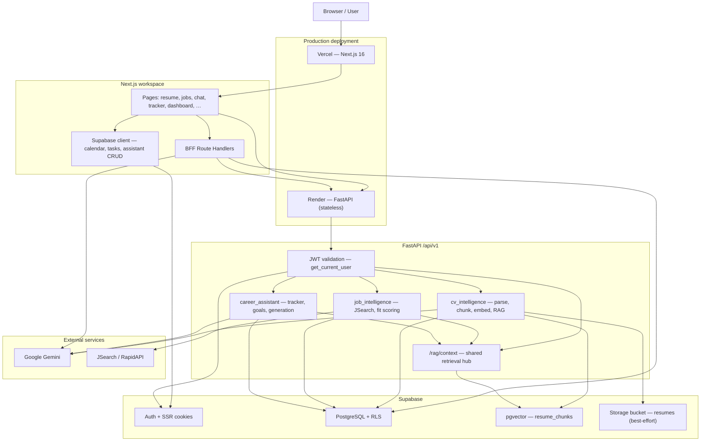
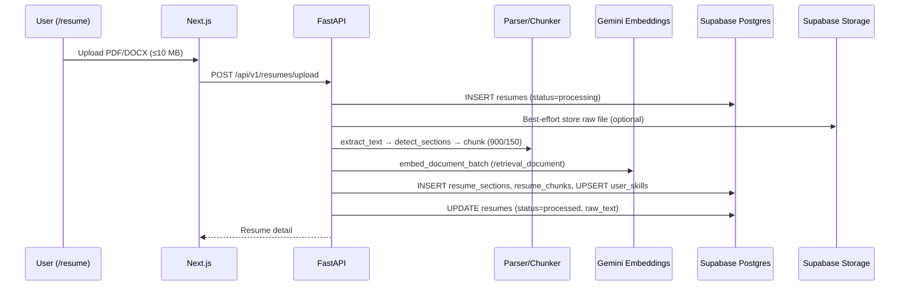
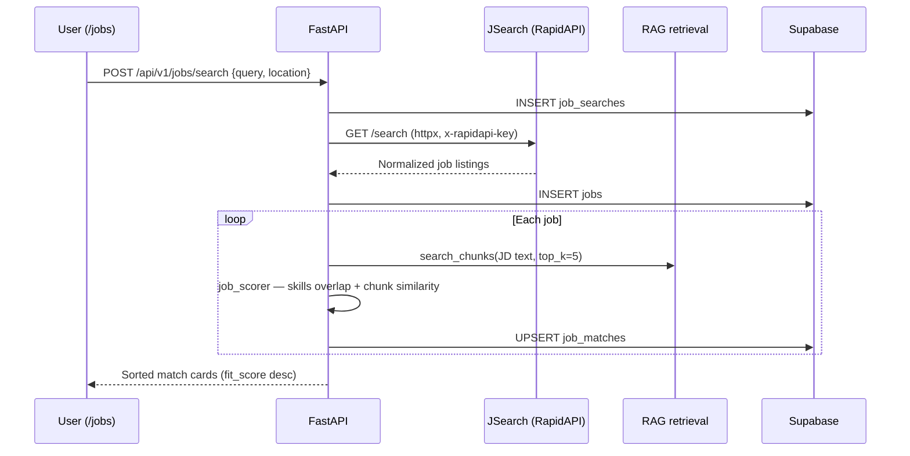
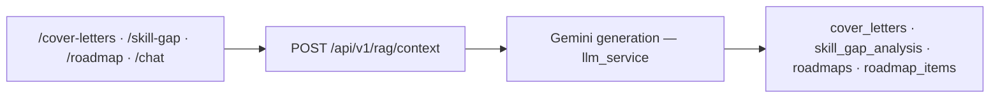
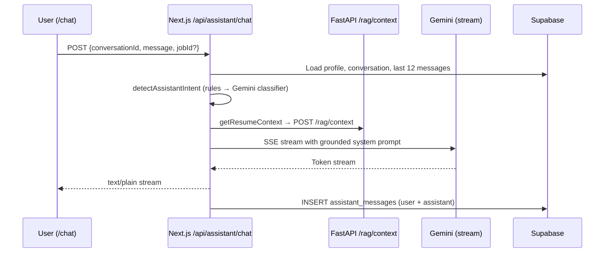

# CareerPilot — System Design Document

> **Purpose:** Hackathon submission artifact covering architecture, data flow, scaling to 10,000 users, cost per active user/month, and production bottlenecks.  
> **Codebase audit date:** June 6, 2026  
> **Stack:** Next.js 16 · FastAPI · Supabase (PostgreSQL + pgvector + Auth) · Google Gemini · JSearch (RapidAPI)

---

## 1. Executive Summary

CareerPilot is an AI-powered career co-pilot. A user uploads or builds a CV once; the backend parses, chunks, embeds, and stores it in Supabase PostgreSQL with **pgvector**. Downstream features—job fit scoring, grounded chat, cover letters, skill-gap analysis, roadmaps, dashboard nudges, and interview prep—all retrieve evidence from that same RAG store rather than inventing user background.

The system is a **hybrid three-tier architecture**:

| Layer | Technology | Role |
|---|---|---|
| Frontend | Next.js 16 (App Router), React 19, TanStack Query | Workspace UI, auth gates, some BFF route handlers |
| Backend API | FastAPI + Uvicorn (Python 3.11) | CV pipeline, job search, tracker, goals, shared RAG, career generation |
| Data & Auth | Supabase | PostgreSQL 15, RLS, pgvector, cookie sessions, optional Storage |
| AI | Google Gemini | Embeddings, CV Q&A, chat streaming, generation, nudges, interview evaluation |
| External tools | JSearch via RapidAPI | Live job listings (external tool call requirement) |

Local development runs via **Docker Compose** (`backend:8000`, `frontend:3000`). Production target: **Vercel** (frontend) + **Render/Railway** (FastAPI) + **Supabase Pro** (database/auth).

---

## 2. Architecture Diagram



### 2.1 Backend module map

| Module | Prefix | Responsibility |
|---|---|---|
| `cv_intelligence` | `/api/v1/resumes`, `/api/v1/rag` | Upload/build CV, chunk, embed, semantic search, grounded Q&A |
| `job_intelligence` | `/api/v1/jobs` | JSearch adapter, programmatic fit scoring, match persistence, save-to-tracker |
| `career_assistant` | `/api/v1/applications`, `/api/v1/goals`, `/api/v1/career` | Kanban tracker, goals/tasks, cover letters, skill gap, roadmaps |
| `core` | — | Auth, config, Supabase service-role client, embedding validation at startup |

### 2.2 Frontend route map (authenticated workspace)

| Route | Data path |
|---|---|
| `/resume` | FastAPI — upload, query, answer |
| `/jobs` | FastAPI — search, matches, save to tracker |
| `/skill-gap` | FastAPI — analyze + list/detail |
| `/cover-letters` | Next.js BFF + FastAPI career routes |
| `/roadmap` | Next.js BFF + FastAPI career routes |
| `/chat` | Next.js BFF → RAG context via FastAPI → Gemini stream |
| `/interview-prep` | Next.js BFF — sessions, evaluation |
| `/tracker`, `/goals` | FastAPI |
| `/calendar`, standalone tasks | Supabase direct (RLS) |
| `/dashboard` | Next.js BFF metrics + nudge generation |

### 2.3 Three request paths (important for scaling)

```text
Path A — FastAPI (heavy compute, service role)
  Browser → apiRequest(Bearer JWT) → FastAPI → Supabase (service role, user_id filter)

Path B — Next.js BFF (LLM streaming, aggregation)
  Browser → /api/* route handler → Gemini API and/or Supabase and/or FastAPI

Path C — Supabase direct (simple CRUD, RLS)
  Browser → Supabase anon key + user JWT → Postgres (RLS enforced)
```

This split keeps long-running AI streams on Vercel serverless while CV ingestion and job scoring stay on a persistent Python worker—but it also means **Gemini is called from two runtimes** (FastAPI and Next.js), which affects quota tracking and cost attribution.

---

## 3. Data Flow

### 3.1 CV upload and RAG core (single source of truth)

This is the foundation for all four product pillars.



**Key implementation details (from code):**

- Chunking: 900 characters, 150 overlap, global `chunk_index` across sections (`chunker.py`).
- Embeddings: Gemini `models/embedding-001`, dimension controlled by `EMBEDDING_VECTOR_DIM` (default **384**, aligned with pgvector RPC `vector(384)`).
- Skills: Gemini analysis provider with deterministic regex fallback (~50+ keywords, 6 categories).
- Storage: `_store_resume_file()` uploads to private bucket `{user_id}/{resume_id}/{filename}` when Storage API is available; pipeline continues if storage fails.
- Alternative inputs: in-app CV builder (`POST /resumes/build`) and manual structured entry bypass file upload but follow the same chunk → embed → skills path.

**Retrieval strategy** (`retrieval_service.py`):

1. Embed query with `retrieval_query` task type.
2. Try Supabase RPC `match_resume_chunks` / `match_resume_chunks_with_resume` (IVFFlat cosine).
3. On RPC failure → NumPy cosine fallback over fetched rows.
4. Filter results with `similarity < 0.05`.
5. Fail with HTTP 503 if embedding dimension mismatch when `RETRIEVAL_REQUIRE_DIM_MATCH=true`.

**Shared RAG hub** (`rag_context_service.py`, `POST /api/v1/rag/context`):

- Intent-aware `top_k` (cover letter: 8, skill gap: 6, general: 5).
- Formats up to 6,000 characters of evidence for LLM prompts.
- Used by FastAPI career generation **and** Next.js assistant via `getResumeContext()` → FastAPI RAG endpoint with Supabase text fallback.

### 3.2 Job search and fit scoring



**Fit score formula** (programmatic, not LLM-only — satisfies hackathon requirement):

```text
fit_score = round(100 × (0.6 × skills_overlap_ratio + 0.4 × mean_top5_chunk_similarity), 2)

skills_overlap_ratio = |jd_skills ∩ user_skills| / |jd_skills|   (0 if no JD skills)
mean_top5_chunk_similarity = mean cosine similarity of top-5 resume chunks for JD text
```

JD skills use the same deterministic extractor as CV parsing. Evidence chunk IDs are stored on `job_matches.evidence_chunks` for UI traceability.

**Downstream:** `POST /api/v1/jobs/matches/{id}/save` creates an `applications` row (`status=saved`) linking `job_id` and `job_match_id`. Job Hunter UI deep-links to cover letters, skill gap, roadmap, chat, and tracker with URL prefill (`job-actions.ts`).

### 3.3 Career artifact generation (cover letter, skill gap, roadmap)



FastAPI routes (`/api/v1/career/*`):

- `POST /cover-letters/generate` → RAG + `generate_cover_letter()` → INSERT `cover_letters`
- `POST /skill-gap/analyze` → RAG + JD skill extraction + `analyze_skill_gap()` → INSERT `skill_gap_analysis`
- `POST /roadmaps/generate` → RAG + structured roadmap → INSERT `roadmaps` + `roadmap_items`

Next.js BFF routes mirror some flows for UI convenience (`/api/cover-letter/*`, `/api/roadmap/*`) and support edit/regenerate, create-task, and add-to-calendar actions on roadmap items.

### 3.4 AI assistant chat



**Memory:** Last 12 messages per conversation (`loadConversationMemory`). **Grounding:** RAG chunks + optional job context via `getJobContext`. **Hallucination guard:** Explicit banners and prompt rules when no CV is on file. Interview prep mode uses a separate prompt stack and problem bank.

### 3.5 Tracker, dashboard, and nudges

**Kanban tracker:**

```text
job_matches → POST …/save → applications (saved)
  → PATCH …/status → RPC change_application_status → application_history
```

**Dashboard** (`GET /api/dashboard/metrics`):

- Parallel Supabase reads: applications, roadmaps, completed tasks, upcoming calendar events, user_skills count.
- Computes pipeline chart, weekly streak (`calculateWeeklyStreak`), recent activity, roadmap progress.

**AI nudges** (`POST /api/reminders/generate`):

- Collects activity summary (applications, high-fit unsaved matches, overdue tasks, upcoming deadlines).
- Calls Gemini to produce structured nudge JSON; merges with deterministic nudges (e.g. unsaved high-fit jobs).
- **In-memory cache** per user ID in the Node.js process (`nudgeCache` Map) — effective for single-instance dev, not for multi-instance production without Redis.

### 3.6 Authentication and authorization

```text
Supabase Auth (email/password)
  → HTTP-only cookies (@supabase/ssr)
  → Server pages: getUser() gate → redirect /login?next=
  → Client: session.access_token → Authorization: Bearer on FastAPI calls
  → FastAPI: get_current_user() validates JWT
  → Service role client bypasses RLS; every query filters .eq("user_id", user_id)
  → Direct Supabase reads/writes: anon key + JWT, RLS enforced
```

---

## 4. Database model (summary)

Authoritative DDL: `supabase/migrations/`. Core tables by domain:

| Domain | Tables |
|---|---|
| Core | `profiles`, `evaluation_tests` |
| CV Intelligence | `resumes`, `resume_sections`, `resume_chunks`, `user_skills` |
| Job Intelligence | `job_searches`, `jobs`, `job_matches` |
| Career Assistant | `applications`, `application_history`, `goals`, `tasks`, `calendar_events`, `assistant_conversations`, `assistant_messages`, `cover_letters`, `roadmaps`, `roadmap_items`, `skill_gap_analysis` |

**Vector index:** IVFFlat on `resume_chunks.embedding` (`vector_cosine_ops`). Optional Alembic path adds `embedding_new vector(768)` for Gemini dimension upgrades.

**RPC functions:**

- `match_resume_chunks(query_embedding, match_user_id, match_count)`
- `match_resume_chunks_with_resume(..., match_resume_id, ...)`
- `change_application_status(...)` — atomic Kanban status + history

---

## 5. Scaling to 10,000 Users

Assumption: **10,000 monthly active users (MAU)** with moderate career-search usage—not 10,000 concurrent connections. Peak concurrent users during a demo or launch window is a separate (smaller) number; the plan below targets sustained MAU.

### 5.1 Traffic profile (planning assumption)

| Per active user / month | Volume at 10k MAU |
|---|---|
| 1 CV upload or rebuild | 10,000 uploads |
| 3 job searches | 30,000 JSearch calls |
| 2 AI workflows (chat, cover letter, gap, roadmap, nudge) | 20,000 Gemini generation calls |
| 5 assistant messages (avg) | 50,000 chat turns |
| Dashboard + tracker reads | ~200,000 lightweight DB reads |

These assumptions drive cost and bottleneck analysis below.

### 5.2 Frontend (Next.js on Vercel)

| Strategy | Rationale |
|---|---|
| Deploy to Vercel Pro with CDN for static assets | Landing and shared JS/CSS cache at edge |
| Keep workspace pages dynamic (auth-gated) | SSR cookie validation; no stale user data |
| React Query `staleTime` (~20s) + targeted invalidation | Reduces repeated dashboard/tracker fetches during navigation |
| Split BFF routes by runtime budget | Chat and nudge routes need longer serverless timeouts (Vercel Pro: 60s+) |
| Edge middleware for auth redirect only | Avoid running full Supabase client at edge for every asset |

At 10k MAU, frontend compute is typically **not** the primary cost center unless every page triggers AI generation.

### 5.3 Backend API (FastAPI on Render/Railway)

| Strategy | Rationale |
|---|---|
| **Stateless** horizontal scaling (≥2 instances behind load balancer) | No in-process session state; JWT carries identity |
| Connection pooling to Supabase | Use Supabase pooler URI; avoid one DB conn per request |
| **Background worker queue** for CV processing | Upload currently runs parse → chunk → embed synchronously in the request thread; at scale this blocks workers and causes timeouts |
| Request timeouts + per-user rate limits on expensive endpoints | `/resumes/upload`, `/jobs/search`, `/career/*` |
| Retry with backoff on Gemini and JSearch 429/5xx | Already partially implemented for Gemini model cascade in CV Q&A |

**Recommended worker architecture at scale:**

```text
POST /resumes/upload → enqueue job → return 202 + resume_id (status=processing)
Worker (Celery/RQ + Redis) → process_resume() → UPDATE status=processed
Frontend polls GET /resumes/{id} or uses Supabase realtime on status column
```

### 5.4 Database and auth (Supabase Pro)

| Strategy | Rationale |
|---|---|
| Supabase Pro + connection pooler (transaction mode for serverless, session for workers) | Default free-tier connection limits exhaust quickly with FastAPI + Vercel |
| Covering indexes on hot paths | `applications(user_id)`, `job_matches(user_id, created_at DESC)`, `resume_chunks(user_id, resume_id)`, `assistant_messages(conversation_id)` |
| RLS remains for Path C (direct client) | Backend must continue explicit `user_id` filters with service role |
| Read replicas (Team plan) if dashboard aggregates become slow | Metrics route runs 5+ parallel queries per page load |
| Partition or archive old `jobs` rows | JSearch inserts duplicate listings across searches today (no unique on `source_url`) |

**Storage growth estimate at 10k users:**

```text
~10k resumes × ~15 chunks × (768-dim vector ≈ 3 KB + text ≈ 1 KB) ≈ 600 MB vectors + text
+ job_matches, messages, applications → low GB total on Pro plan
```

### 5.5 Vector search (pgvector)

| Stage | Action |
|---|---|
| Now (<50k chunks) | IVFFlat with tuned `lists` / `probes`; ensure `EMBEDDING_VECTOR_DIM` matches RPC signature |
| Growth (>500k chunks) | Migrate to **HNSW** index for stable recall/latency |
| Per-user scope | RPC already filters `match_user_id`; avoids full-table scan across tenants |
| Cache | Short TTL cache (Redis) for repeated RAG queries against same job ID within a session |

### 5.6 External services

| Service | Scaling approach |
|---|---|
| **Gemini** | Per-user daily quotas; default to Flash-class models; Pro/strong models for retries only; centralize usage metrics across FastAPI + Next.js |
| **JSearch** | Cache recent `(query, location)` results 15–60 min; Ultra plan covers 50k req/mo (30k estimated here); upgrade to Mega if searches/user increases |
| **Supabase Auth** | Built-in; no custom auth server needed at 10k MAU |

### 5.7 Target production topology (10k MAU)

```text
                    ┌─────────────┐
                    │  Cloudflare  │ (optional WAF/CDN)
                    └──────┬──────┘
                           │
              ┌────────────┴────────────┐
              │      Vercel (Next.js)      │
              │  static + BFF serverless   │
              └────────────┬────────────┘
                           │
         ┌─────────────────┼─────────────────┐
         │                 │                 │
         ▼                 ▼                 ▼
┌─────────────┐   ┌─────────────┐   ┌─────────────┐
│ Render ×2   │   │ Render ×1   │   │  Supabase   │
│ FastAPI web │   │ CV worker   │   │ Pro + pool  │
└──────┬──────┘   └──────┬──────┘   └──────┬──────┘
       │                 │                 │
       └────────┬────────┴────────┬────────┘
                │                 │
                ▼                 ▼
         ┌────────────┐   ┌────────────┐
         │ Redis queue │   │  pgvector  │
         └────────────┘   └────────────┘
                │
                ▼
         ┌────────────┐
         │ Gemini API │
         │ JSearch API│
         └────────────┘
```

---

## 6. Estimated Cost (10,000 MAU)

> Planning estimates based on public pricing pages (Vercel, Render, Supabase, Google AI, RapidAPI JSearch). **Not billing guarantees.** Actual cost depends on AI usage intensity, region, and plan changes.

### 6.1 Monthly infrastructure (baseline)

| Component | Planning choice | Est. monthly (USD) |
|---|---|---:|
| Frontend | Vercel Pro | $20 |
| Backend API | Render Standard web service × 2 | $50 |
| Background worker | Render Starter worker × 1 | $7 |
| Queue | Upstash Redis (pay-as-you-go) | $10 |
| Database / Auth / Vector | Supabase Pro (+ modest compute) | $75 |
| Job search | JSearch Ultra (50k req/mo included) | $75 |
| Gemini AI | Embeddings + generation (moderate usage) | $25–$120 |
| Observability buffer | Logs, overages, storage growth | $25 |
| **Total** | | **$287–$382 / month** |

### 6.2 Cost per active user per month

```text
Low AI usage:  $287 / 10,000 ≈ $0.029 per MAU / month
High AI usage: $382 / 10,000 ≈ $0.038 per MAU / month
```

Rounded for planning: **~$0.03 per active user per month** at the assumed moderate usage profile.

### 6.3 Variable cost drivers (formulas)

**JSearch:**

```text
Monthly requests ≈ MAU × searches_per_user
30,000 requests at 3 searches/user → within Ultra 50k allowance → $75 flat
Overage ≈ max(0, requests − 50,000) × overage_rate
```

**Gemini (largest variable line item):**

```text
Embedding cost  ≈ (CV_tokens + query_tokens) / 1e6 × embedding_rate
Generation cost ≈ (input_tokens / 1e6 × input_rate) + (output_tokens / 1e6 × output_rate)

At 10k uploads × ~3k tokens + 50k chat turns × ~2k tokens:
  → monitor monthly; can exceed $120 if users run 10+ AI workflows each
```

**Sensitivity:** If average AI workflows rise from 2 to **10 per user/month**, Gemini alone can reach **$300–$500/mo**, making AI ~50% of total cost. Per-user quotas and Flash-default models are essential.

### 6.4 Pricing references

- [Vercel pricing](https://vercel.com/pricing)
- [Render pricing](https://render.com/pricing)
- [Supabase pricing](https://supabase.com/pricing)
- [Gemini API pricing](https://ai.google.dev/pricing)
- [JSearch / RapidAPI pricing](https://rapidapi.com/letscrape-6bRBa3QguO5/api/jsearch/pricing)

---

## 7. Key Bottlenecks and Mitigations

| # | Bottleneck | Risk at scale | Evidence in codebase | Mitigation |
|---|---|---|---|---|
| 1 | **Gemini quota and cost** | Chat, CV embed, cover letters, skill gap, roadmaps, nudges, interview prep, and CV Q&A all call Gemini from FastAPI and/or Next.js BFF | `llm_service.py`, `route.ts`, `reminders/generate`, `interview-prep/*` | Unified usage dashboard; per-user daily caps; Flash as default; cache nudge generation; batch embeddings |
| 2 | **Synchronous CV processing** | Upload holds an API worker for parse + N embedding API calls + DB writes; timeouts under concurrent uploads | `resume_service.process_resume()` runs inline on `POST /upload` | Background worker queue; status polling; retry failed embedding batches |
| 3 | **JSearch quota and latency** | 30k+ searches/mo; 429 blocks Job Hunter entirely | `JSearchAdapter` via httpx; error mapping for 429 | Response cache; debounce repeat searches; plan upgrade; saved search history reuse |
| 4 | **Dual Gemini entry points** | Hard to enforce global rate limits; duplicate SDK config | FastAPI + 6+ Next.js routes call Gemini independently | Proxy all generation through FastAPI or a shared AI gateway service |
| 5 | **In-memory nudge cache** | Cache not shared across Vercel/Render instances; stale or duplicate nudges | `nudgeCache = new Map()` in `reminders/generate/route.ts` | Redis/Upstash with TTL; or generate nudges in FastAPI worker |
| 6 | **pgvector index scaling** | IVFFlat recall degrades as `resume_chunks` grows; RPC dimension must match stored vectors | IVFFlat on `embedding`; Alembic `embedding_new` for 768-dim migration | Align `EMBEDDING_VECTOR_DIM`, RPC, and column before prod; HNSW at >500k chunks; archive inactive resume chunks |
| 7 | **Database connection pressure** | Vercel serverless + 2 FastAPI instances + workers can exhaust Supabase conn limit | Service role singleton in FastAPI; multiple Supabase clients in BFF routes | Supabase pooler everywhere; PgBouncer transaction mode for serverless; limit concurrent BFF DB calls |
| 8 | **Job table duplication** | Same JSearch listing inserted on every search → storage bloat, slower scoring loops | `job_service._persist_jobs` without dedup key | Unique index on `(source, source_url)` with upsert; periodic cleanup job |
| 9 | **No push/email reminder delivery** | Calendar `reminder_time` stored but never delivered | Calendar CRUD only; nudges are in-app on dashboard load | Supabase Edge Functions + cron, or external scheduler (Inngest, Trigger.dev) |
| 10 | **Observability gaps** | Hard to debug RAG misses, quota exhaustion, or slow JSearch in production | Structured logs in retrieval; no centralized APM | Request IDs across BFF → FastAPI; metrics for p95 RAG latency, Gemini tokens, JSearch errors |
| 11 | **File storage best-effort** | Re-processing from original PDF fails if Storage upload silently failed | `_store_resume_file` swallows errors | Mandatory storage write before marking processed; signed URL access; retention policy |
| 12 | **Parallel job scoring CPU** | Each search scores every returned job with RAG retrieval | Loop in `job_service.search_and_match` | Batch retrieval; cap jobs scored per search; precompute JD embeddings |

### 7.1 Highest-priority pre-production fixes

1. Move CV upload to async worker (bottleneck #2).
2. Centralize Gemini calls and add per-user quotas (bottlenecks #1, #4).
3. Replace in-memory nudge cache with Redis (bottleneck #5).
4. Confirm embedding dimension alignment across config, column, and RPC (bottleneck #6).
5. Add JSearch response caching (bottleneck #3).

---

## 8. Analysis Depth and Accuracy Notes

This document was produced from a full-repo audit, not generic templates:

| Area | Sources verified |
|---|---|
| API surface | `backend/main.py`, all route modules, 29 Next.js `/api/*` handlers |
| RAG pipeline | `resume_service.py`, `retrieval_service.py`, `rag_context_service.py`, `rag.py` |
| Fit scoring | `job_scorer.py` — exact 60/40 formula |
| Auth | `auth.py`, Supabase SSR clients, RLS migrations |
| Assistant grounding | `getResumeContext.ts` → live `/api/v1/rag/context` (not static mock data) |
| Dashboard / nudges | `dashboard/metrics/route.ts`, `reminders/generate/route.ts` |
| Config defaults | `config.py` — `EMBEDDING_VECTOR_DIM=384`, JSearch env aliases |
| Tests | pytest (CV, job, career-assistant); Vitest on BFF routes |
| Hackathon checklist | `problem-statement/checklist.md` — four pillars wired end-to-end |

**Known limitations called out honestly:**

- Cost figures are **order-of-magnitude planning estimates**; Gemini usage dominates variance.
- Scaling plan assumes **moderate** usage (not power-user job hunters running 50 searches/day).
- Production has not been load-tested; p95 latencies are projected from architecture, not benchmarks.
- Interview prep and in-app CV builder add AI surface area not present in early docs—cost model includes them implicitly under Gemini line item.

---

## 9. Acceptance Checklist (submission requirements)

| Requirement | Section |
|---|---|
| Architecture diagram | §2 |
| Data flow (CV, jobs, generation, tracker, auth) | §3 |
| Scale to 10,000 users | §5 |
| Estimated cost per user/month | §6.2 (~$0.03/MAU) |
| Key bottlenecks with mitigations | §7 |
| Depth and accuracy statement | §8 |

---

*CareerPilot — System Design Document for hackathon submission (`Docs/submit/`).*
