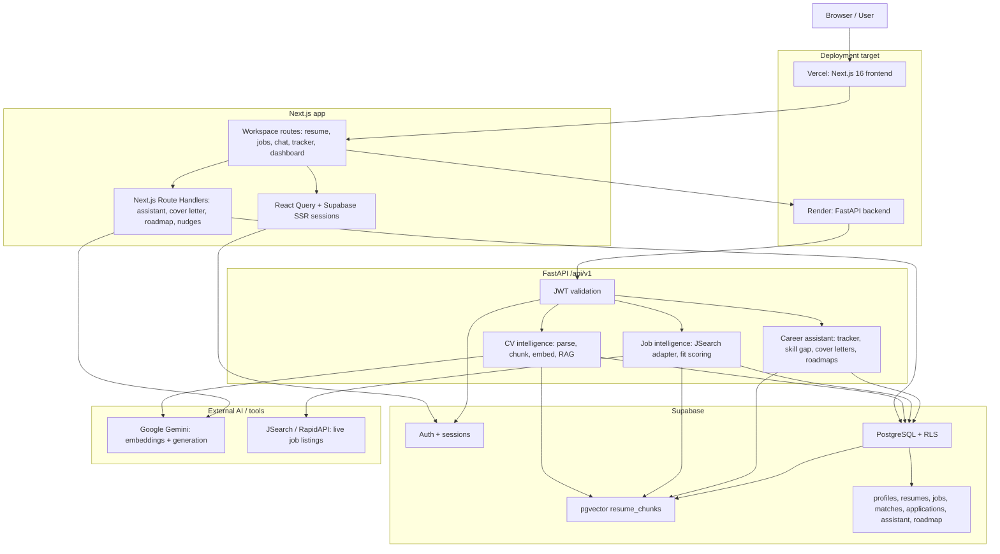

# CareerPilot System Design

## Overview

CareerPilot is an AI-powered career co-pilot that combines CV intelligence, live job search, grounded assistant chat, career artifact generation, and application tracking in one workflow. The user uploads a CV once; the backend parses, chunks, embeds, and stores it in Supabase PostgreSQL with pgvector; downstream modules use that CV context to score jobs, answer questions, generate cover letters, analyze skill gaps, build roadmaps, and keep the tracker/dashboard up to date.

## Architecture Diagram



## Data Flow

### CV Upload and RAG

1. The user uploads a PDF/DOCX on `/resume`.
2. FastAPI validates the file, extracts text, detects resume sections, chunks each section, and sends chunks to Gemini embeddings.
3. Supabase stores `resumes`, `resume_sections`, `resume_chunks`, and `user_skills`.
4. A CV question or career generation request embeds the query, searches `resume_chunks` through pgvector RPC or the NumPy fallback, formats top-k evidence chunks, and asks Gemini to answer from retrieved context.

### Job Search and Fit Scoring

1. The user searches on `/jobs`.
2. FastAPI calls the JSearch adapter through RapidAPI.
3. The job scorer compares job text with `user_skills` and semantically relevant CV chunks.
4. Supabase stores `job_searches`, `jobs`, and `job_matches`; the frontend renders fit score, matched skills, missing skills, and evidence.

### Skill Gap, Cover Letter, and Roadmap

1. The user starts from `/skill-gap`, `/cover-letters`, `/roadmap`, or a job action.
2. FastAPI retrieves CV context with an intent-specific RAG query.
3. Gemini generates structured output using the CV evidence plus optional job description.
4. Supabase persists generated artifacts in `skill_gap_analysis`, `cover_letters`, `roadmaps`, and `roadmap_items`.

### Tracker and Dashboard

1. A job match can be saved into `applications` with a linked `job_id` and `job_match_id`.
2. Status updates write to `applications` and `application_history`.
3. Dashboard metrics aggregate tracker status, resume skill count, recent matches, deadlines, and AI nudges.

### Authentication and Authorization

1. Supabase Auth manages email/password sessions.
2. Next.js server components and browser clients use Supabase SSR/session helpers.
3. FastAPI receives `Authorization: Bearer <token>`, validates the user, and uses a Supabase service-role client.
4. Backend services enforce ownership with `user_id` filters; direct frontend Supabase reads/writes rely on RLS policies.

## Scalability Plan for 10,000 Users

### Frontend

- Host the Next.js app on Vercel with static asset CDN caching and serverless/edge-compatible route handlers.
- Keep authenticated workspace pages dynamic, but cache public landing assets aggressively.
- Use React Query stale times and mutation invalidation to avoid repeated dashboard/tracker fetches during navigation.

### Backend API

- Keep FastAPI stateless so Render can scale horizontally behind its load balancer.
- Run at least two backend instances for production availability once traffic is steady.
- Add request timeouts, per-user rate limits, and queue-backed retries around Gemini and JSearch calls.
- Move long-running CV processing and re-embedding into a background worker queue so uploads return quickly and API workers stay responsive.

### Database and Auth

- Use Supabase Pro with the connection pooler enabled; route server workloads through pooled connections where possible.
- Keep RLS for direct client tables and preserve explicit `user_id` filters in service-role backend code.
- Add covering indexes for high-read paths such as `applications.user_id`, `job_matches.user_id`, `resume_chunks.user_id`, and `created_at` ordering.
- Align the production embedding dimension before launch: Gemini runtime currently targets 768 dimensions, while older pgvector RPC/migration paths mention 384 dimensions.

### Vector Search

- Keep pgvector indexes on active embedding columns and tune IVFFlat lists/probes for recall and latency.
- Upgrade to HNSW when resume chunk volume grows enough that IVFFlat recall/latency becomes unstable.
- Cache common per-user retrieval results briefly for repeated skill-gap/cover-letter/roadmap workflows against the same job.

### External Services

- Put Gemini and JSearch behind server-side adapters with explicit quotas, retries, and user-visible error messages.
- Track per-user and global API usage so one user cannot exhaust the shared quota.
- Prefer cheaper Gemini Flash-class models for routine generation; reserve stronger models for retries or premium-quality tasks.

## Estimated Cost

These estimates use public pricing pages checked for this document on June 1, 2026. They are planning estimates, not billing guarantees. Actual cost depends heavily on AI usage, job-search volume, region, and provider plan changes.

### Assumptions

- 10,000 monthly active users.
- Average monthly usage per active user:
  - 1 CV upload or reprocess.
  - 2 AI generation workflows such as chat, cover letter, skill gap, or roadmap.
  - 3 job searches.
- Deployment model:
  - Vercel for the Next.js frontend.
  - Render for FastAPI.
  - Supabase Pro for auth, Postgres, RLS, and pgvector.
  - Gemini paid tier for embeddings and generation.
  - JSearch Ultra on RapidAPI for live job search.

### Monthly Estimate

| Component | Planning choice | Estimated monthly cost |
|---|---|---:|
| Frontend | Vercel Pro | $20 |
| Backend | Render Standard web service, one instance | $25 |
| Database/Auth/Vector | Supabase Pro plus medium compute assumption | $75 |
| Job search | JSearch Ultra: 50,000 requests/month included | $75 |
| Gemini AI | Embeddings + generation variable estimate | $25-$100 |
| Observability/contingency | Logs, overage buffer, small storage growth | $25 |
| **Total** | Baseline production estimate | **$245-$320/month** |

At 10,000 monthly active users, this is approximately:

```text
$245 / 10,000 = $0.0245 per active user/month
$320 / 10,000 = $0.0320 per active user/month
```

### Variable Cost Formulas

```text
JSearch cost ~= plan fee + max(0, requests - included_requests) * overage_per_request
Monthly JSearch requests ~= active_users * searches_per_user
```

With 10,000 users and 3 searches/user/month:

```text
30,000 requests/month, within the 50,000-request Ultra allowance
Estimated JSearch line item: $75/month
```

```text
Gemini generation cost ~= (input_tokens / 1,000,000 * input_rate)
                       + (output_tokens / 1,000,000 * output_rate)
Gemini embedding cost ~= embedded_tokens / 1,000,000 * embedding_rate
```

For the assumed 2 AI workflows/user/month, Gemini should be monitored as the largest variable line item. If usage rises to 10+ AI workflows/user/month, Gemini can overtake hosting/database costs.

### Pricing Source Links

- [Vercel pricing](https://vercel.com/pricing)
- [Render pricing](https://render.com/pricing)
- [Supabase pricing](https://supabase.com/pricing)
- [Gemini API pricing](https://ai.google.dev/pricing)
- [JSearch/RapidAPI pricing](https://rapidapi.com/letscrape-6bRBa3QguO5/api/jsearch/pricing)

## Bottlenecks and Mitigations

| Bottleneck | Risk | Mitigation |
|---|---|---|
| Gemini quota and cost | Chat, cover letters, skill gaps, roadmaps, embeddings, and nudges all depend on Gemini. Quota exhaustion can block key workflows. | Add per-user quotas, global spend alerts, cheaper default models, deterministic fallbacks where acceptable, and clear retry/error states. |
| JSearch quota | Live search volume can exceed RapidAPI plan limits during demos or high traffic. | Cache recent searches, limit re-run frequency, use saved search history, and upgrade from Ultra to Mega if monthly searches exceed 50,000. |
| pgvector dimension alignment | Runtime Gemini embeddings target 768 dimensions while older migration/RPC docs mention 384. Mismatch can break vector RPC search. | Before production, align `EMBEDDING_VECTOR_DIM`, active vector column, RPC signatures, indexes, and re-embedding strategy. |
| Synchronous CV processing | Parsing, chunking, embedding, skill extraction, and DB writes can make uploads slow and tie up API workers. | Move processing to a background worker, keep `status=processing`, stream/poll progress, and retry failed embedding batches. |
| Database connection limits | 10,000 users can cause connection pressure if direct and backend clients grow without pooling. | Use Supabase pooler, keep backend stateless, batch writes, avoid long transactions, and monitor slow queries. |
| Vector search latency | Resume chunks grow with users and repeated uploads. Poor index tuning can slow RAG and job scoring. | Tune pgvector indexes, consider HNSW, limit top-k, archive inactive resume chunks, and cache repeated retrievals. |
| File storage gap | `resumes.file_url` exists, but raw uploaded files are not stored in Supabase Storage. Reprocessing from original file is limited. | Store original files in a private Supabase Storage bucket with signed access and retention controls. |
| Observability gaps | Debugging production failures is harder without metrics for AI calls, retrieval latency, API errors, and quota usage. | Add structured logs, request IDs, provider latency metrics, quota dashboards, and alerting for 5xx/error spikes. |
| Chat context wiring | Existing docs note the Next.js chat context path has used static/mock CV context in places. | Route chat context through the same RAG service or active resume `raw_text` before relying on chat as fully CV-grounded in production. |

## Acceptance Checklist

- Architecture diagram: included.
- Data flow: included for CV/RAG, jobs, generation, tracker/dashboard, and auth.
- Scalability plan: included for 10,000 users.
- Estimated cost: included with per-user/month estimate and formulas.
- Bottlenecks: included with mitigations.
