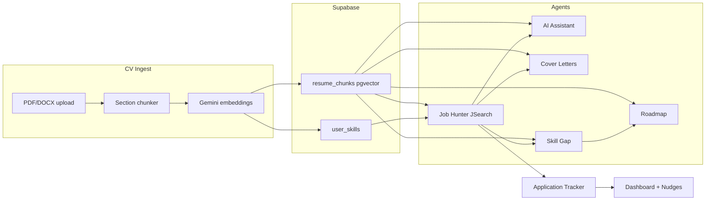

# CareerPilot

An AI-powered career co-pilot: upload your CV once, then search jobs, analyze fit, chat with a grounded assistant, generate cover letters and roadmaps, and track applications in one platform.

---

## Architecture



| Layer | Stack |
|---|---|
| Frontend | Next.js 16 (App Router), React 19, TypeScript, Tailwind CSS 4, TanStack Query |
| Auth | Supabase SSR cookie sessions |
| Backend | FastAPI + Uvicorn, Python 3.11 |
| Database | Supabase PostgreSQL + pgvector |
| Embeddings | Google Gemini (`EMBEDDING_BACKEND=gemini`) |
| LLM | Google Gemini (assistant, cover letters, skill gap, roadmaps, nudges) |
| Job search | JSearch via RapidAPI |
| Containers | Docker Compose — backend `:8000`, frontend `:3000` |

### Backend modules

- `cv_intelligence` — upload, chunk, embed, RAG retrieval, grounded Q&A
- `job_intelligence` — JSearch adapter, programmatic fit scoring, match persistence
- `career_assistant` — applications tracker, cover letters, skill gap, roadmaps
- `core` — auth, config, Supabase client

### Frontend routes

| Route | Purpose |
|---|---|
| `/resume` | CV upload, query, grounded answers |
| `/jobs` | Job Hunter — search, fit cards, save to tracker |
| `/skill-gap` | Skill gap analysis with Job Hunter prefill |
| `/chat` | CV-grounded assistant with optional job context |
| `/cover-letters` | Cover letter studio |
| `/roadmap` | Weekly learning plans |
| `/tracker` | Kanban application board |
| `/goals` | Goals and tasks |
| `/calendar` | Events and deadlines |
| `/dashboard` | Metrics, pipeline, AI nudges |

---

## Getting Started

### Prerequisites

- Docker and Docker Compose, **or** Python 3.11+ and Node.js 20+

### Environment variables

```bash
cp backend/.env.example backend/.env
cp frontend/.env.local.example frontend/.env.local
```

| Variable | Where | Purpose |
|---|---|---|
| `NEXT_PUBLIC_SUPABASE_URL` | frontend | Supabase project URL |
| `NEXT_PUBLIC_SUPABASE_ANON_KEY` | frontend | Public anon key |
| `NEXT_PUBLIC_API_URL` | frontend | FastAPI base (`http://localhost:8000`) |
| `SUPABASE_URL` | backend | Project URL (no `/rest/v1/` suffix) |
| `SUPABASE_SERVICE_ROLE_KEY` | backend | Server-only service role key |
| `GEMINI_API_KEY` | backend + frontend BFF | Gemini for embeddings and generation |
| `JSEARCH_API_KEY` | backend | RapidAPI key for live job search |
| `JSEARCH_API_HOST` | backend | Default `jsearch.p.rapidapi.com` |
| `JSEARCH_BASE_URL` | backend | Default `https://jsearch.p.rapidapi.com` |

### Run with Docker

```bash
docker compose up --build
```

- Frontend: http://localhost:3000
- Backend: http://localhost:8000
- API docs: http://localhost:8000/docs

### Run individually

**Backend:**

```bash
cd backend
python -m venv venv
pip install -r requirements.txt
uvicorn main:app --reload
```

**Frontend:**

```bash
cd frontend
npm install
npm run dev
```

### Database migrations

```bash
npx supabase link --project-ref <your-ref>
npx supabase db push
```

---

## End-to-end demo flow

1. Upload and process a CV on `/resume`
2. Search jobs on `/jobs` → review fit score, gaps, CV evidence
3. Use match actions: cover letter, skill gap, roadmap, assistant
4. Save to tracker → view fit data in application drawer
5. Check `/dashboard` for skills count and job-match nudges

See [`Docs/evaluation-suite.md`](Docs/evaluation-suite.md) for documented test cases and a 5-minute demo script.

---

## Running Tests

```bash
cd backend
python -m pytest test/ -v
```

```bash
cd frontend
npm test
```

---

## Related Documentation

| Document | Purpose |
|---|---|
| [`Docs/evaluation-suite.md`](Docs/evaluation-suite.md) | Evaluation cases + demo script |
| [`Docs/present-state.md`](Docs/present-state.md) | Feature matrix |
| [`Docs/cv-intelligence-implementation.md`](Docs/cv-intelligence-implementation.md) | CV/RAG pipeline reference |
| [`problem-statement/checklist.md`](problem-statement/checklist.md) | Hackathon requirement checklist |
